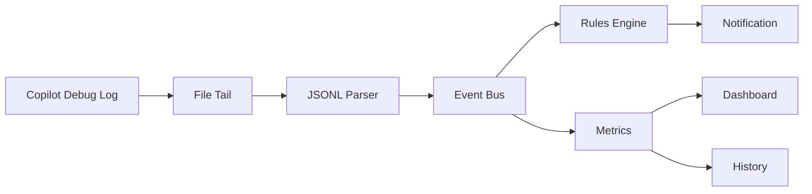
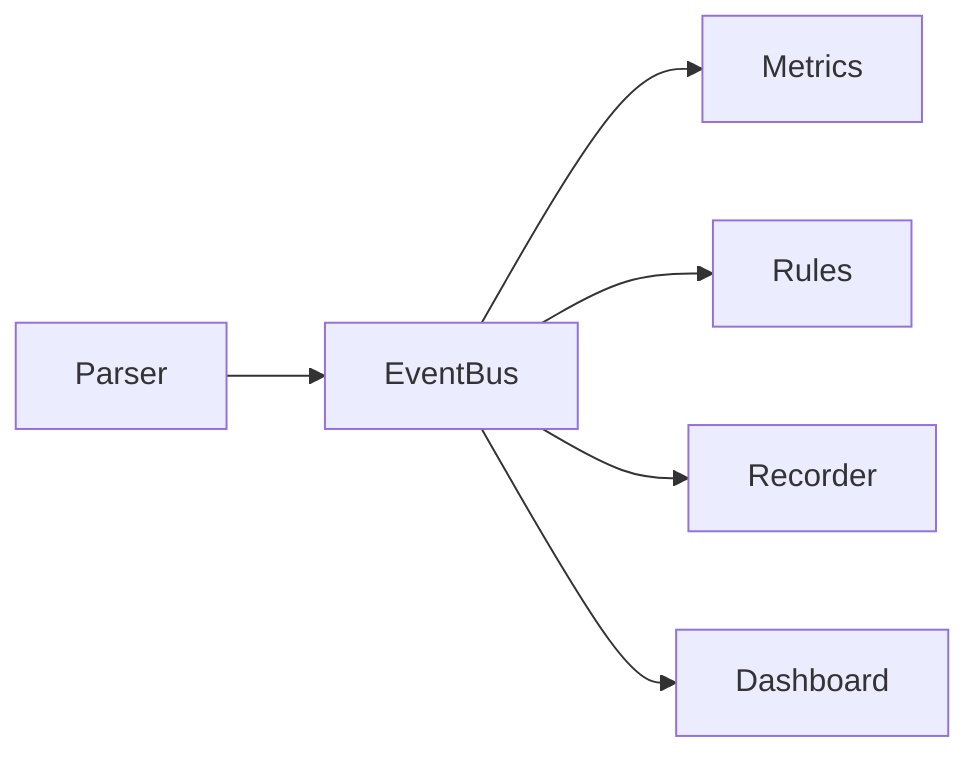
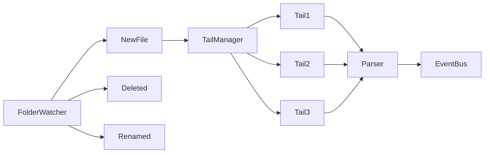
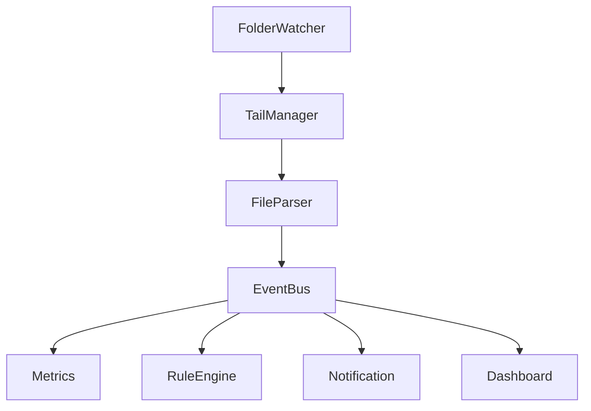

我觉得这是一个**非常值得做**的方向，而且**不要做成日志分析器，而要做成 Copilot 的 Observability Agent**。

你的目标不是分析历史，而是**实时监控 Agent 的行为**。

## 整体架构



整个过程都是**流式(Stream)**，而不是反复读取整个文件。

---

# 第一层：Tail 文件

不要用 `fs.watch()`。

原因：

* macOS 不可靠
* 日志 rotate 会丢
* append 不稳定

推荐：

```text
tail-file
```

或者

```text
@logdna/tail-file
```

它们实现了：

* inode 检测
* rotate
* truncate
* append

例如

```ts
const tail = new TailFile(logFile)

for await (const line of tail) {
    handle(JSON.parse(line))
}
```

完全不用自己维护 offset。

---

# 第二层：Event Bus

不要 Parser 直接分析。



以后加功能不用改 Parser。

例如：

```ts
eventBus.emit({
    type:"llm_request",
    ...
})
```

---

# 第三层：State

维护一个 Session State。

```ts
interface SessionState{

    promptTokens:number

    completionTokens:number

    cacheTokens:number

    toolCalls:number

    readFiles:number

    edits:number

    retries:number

    contextBytes:number

}
```

所有 Rule 都只看 State。

---

# 第四层：Rule Engine

我不会写 if else。

而是：

```ts
interface Rule{

    id:string

    match(state,event):boolean

    action(...)
}
```

例如

```text
ContextTooLargeRule

RetryRule

LoopRule

HugePromptRule

TooManyReadFileRule

SlowToolRule

LargeDiffRule

ModelSwitchRule

SubAgentExplosionRule
```

插件化。

以后别人还能自己写 Rule。

---

# 举几个很有价值的 Rule

## 1 Context 已接近窗口

例如

```
Current

220k

Limit

256k
```

直接报警。

```
⚠️ Context 已达到 86%

建议 /clear
```

---

## 2 ReadFile 风暴

例如

```
readFile

200

次
```

说明 Agent 在瞎搜。

报警：

```
Agent 正在搜索整个仓库
```

---

## 3 Tool Loop

例如

```
grep

↓

readFile

↓

grep

↓

readFile

↓

grep
```

持续 40 次。

报警：

```
Agent 疑似进入 Loop
```

---

## 4 Retry

连续

```
edit

失败

edit

失败

edit

失败
```

说明 Prompt 有问题。

---

## 5 Prompt Explosion

例如

```
Prompt

60k

↓

90k

↓

130k

↓

170k
```

说明 Context 在疯狂增长。

画曲线。

---

## 6 MCP 超时

统计：

```
MCP

平均

3.8s

95%

12s
```

直接提示：

```
MCP Server 很慢
```

---

# 第五层：Notification

例如

```text
terminal-notifier
```

macOS 原生通知。

或者

```
node-notifier
```

Windows/macOS/Linux。

以后还能：

* Slack
* Discord
* 飞书
* Telegram

---

# Metrics

维护一个实时指标。

例如

```ts
metrics={

contextTokens,

toolCalls,

cost,

latency,

retry,

loop,

subAgents,

cacheHit,

}
```

每收到 Event 更新。

根本不用重新统计。

---

# Dashboard

我不会做网页。

直接：

```
┌───────────────────────┐

Context

187k / 256k

██████████░░

Tool

ReadFile

183

Edit

12

Retry

8

Loop

1

Cost

$0.31

───────────────────────

⚠ Context Too Large

⚠ Loop

⚠ MCP Slow

└───────────────────────┘
```

CLI 就够用了。

---

## 我还会增加一个更有意思的能力

**Agent Health Score（Agent 健康度）**。

根据多个指标实时计算一个健康分，例如：

* Context 使用率（40%）
* Tool 重试率（20%）
* Loop 检测（20%）
* MCP 延迟（10%）
* Prompt 增长速度（10%）

最终给出：

```
Agent Health

96 ✅ Excellent

74 ⚠ Warning

38 ❌ Critical
```

相比单纯监控日志，这种综合评分更容易帮助开发者判断当前 Agent 是否正在高效工作，还是已经进入了上下文膨胀、无效搜索或工具循环等低效率状态。


----------


监控整个文件夹，**Node.js 已经有成熟方案，不建议自己拼 `fs.watch()`**。

如果是 Copilot 的日志目录，我建议采用**Watcher + Tail** 两层架构，而不是单纯监听文件变化。



这样可以处理：

* 新 session 创建
* 新的 `main.jsonl`
* `runSubagent-*.jsonl`
* `tools_*.json`
* `system_prompt_*.json`
* 日志 rotate
* 文件删除

---

## 推荐库一：chokidar（首选）

目前 Node 社区事实标准。

```bash
npm install chokidar
```

```ts
import chokidar from 'chokidar';

const watcher = chokidar.watch(logDir, {
  ignoreInitial: false,
  persistent: true,
  depth: 10,
});

watcher
  .on('add', path => console.log('new', path))
  .on('change', path => console.log('change', path))
  .on('unlink', path => console.log('delete', path));
```

优点：

* macOS FSEvents
* Linux inotify
* Windows ReadDirectoryChangesW

都帮你封装好了。

---

## 推荐库二：Tail + Chokidar

真正实时监控建议：

```
chokidar
      │
发现新的 *.jsonl
      │
      ▼
tail-file
      │
append line
      │
JSON.parse
      │
EventBus
```

例如：

```
workspaceStorage/
    xxx/
        debug-logs/
            abc/
                main.jsonl
            def/
                main.jsonl
```

新的 session 出现：

```
add

↓

TailManager.add()

↓

开始 tail
```

无需扫描整个目录。

---

## TailManager

建议维护一个管理器。

```ts
class TailManager {

    private tails = new Map<string, Tail>();

    add(file){}

    remove(file){}

}
```

避免：

```
同一个文件

↓

重复 tail

↓

重复事件
```

---

## 建议监听哪些文件

实际上不用监听所有 json。

例如：

```
debug-logs/

    main.jsonl              ⭐⭐⭐⭐⭐

    runSubagent-xxx.jsonl   ⭐⭐⭐⭐

    system_prompt_12.json   ⭐⭐⭐⭐

    tools_12.json           ⭐⭐⭐⭐

    title-xx.json           ⭐⭐

    response.json           ⭐
```

Parser 可以根据文件名分发：

```
main.jsonl

↓

MainParser

system_prompt

↓

PromptParser

tools

↓

ToolsParser
```

---

## EventBus 解耦

我推荐这种结构：



以后新增：

* Claude Code
* Codex CLI
* Gemini CLI

只需要新增 Parser。

Rule Engine 不动。

---

## 如果你的目标是长期做这个项目

我会直接抽象成：

```ts
interface LogSource {

    watch(): AsyncIterable<LogEvent>;

}
```

实现：

```
CopilotSource

ClaudeCodeSource

CodexSource

CursorSource

GeminiCLI

Aider
```

后面所有分析器都消费统一的 `LogEvent`。

这样你的工具就不再是“Copilot 日志分析器”，而会变成一个**通用 AI Coding Agent Observability 平台**。这是一个更具扩展性的架构，也方便后续支持多种 Agent 和统一的规则引擎。
