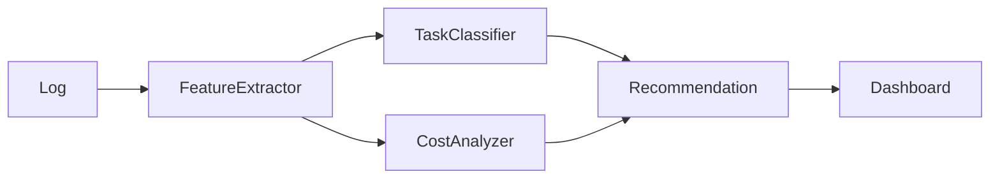
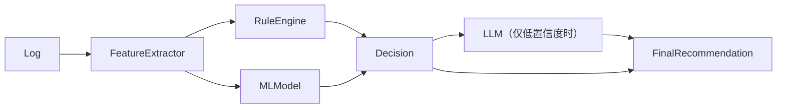
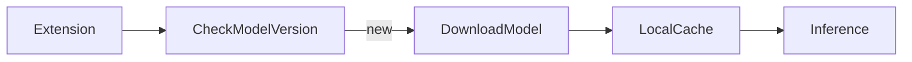

**可以，而且这是我认为这个项目最有价值的能力之一。**

不过需要说明一点：**不能直接从日志证明“这个任务 GPT-5 太强了，GPT-5 mini 就够了”**。日志没有提供一个“如果换模型会怎样”的真实对照实验。

真正可行的是做 **Model Right-Sizing（模型适配）**，也就是根据任务特征给出**概率性建议**，而不是绝对结论。

## 整体架构



关键不是分析 Prompt，而是**分析整个 Agent 行为**。

---

## 第一层：任务分类

根据日志提取特征：

```ts
interface TaskFeatures {
    promptTokens: number;

    toolCalls: number;

    readFiles: number;

    editedFiles: number;

    diffLines: number;

    retries: number;

    subAgents: number;

    elapsedMs: number;

    contextGrowth: number;
}
```

然后分类：

* Bug Fix
* Refactor
* Explain
* Generate Code
* Documentation
* Test Generation
* Search
* Planning
* Architecture
* MCP-heavy

---

## 第二层：复杂度评分

例如：

```text
Complexity Score

Prompt        15%
Repository    25%
Planning      20%
Edit          20%
Iteration     20%
```

最后得到：

```
17 /100
```

或者

```
81 /100
```

---

## 第三层：经验规则

例如：

| 特征                   | 建议      |
| -------------------- | ------- |
| Prompt < 5k Tokens   | Mini 足够 |
| 无 Tool Call          | Mini    |
| 单文件修改                | Mini    |
| Explain Code         | Mini    |
| Generate Unit Test   | Mini    |
| 大量 Repository Search | 中模型     |
| 多轮规划                 | 大模型     |
| Sub Agent            | 大模型     |
| 长 Context            | 大模型     |

这些规则虽然简单，但通常已经很有价值。

---

## 第四层：真正有价值的部分——历史学习

不要只看一次。

例如：

```
1000 次任务

↓

聚类

↓

发现：

Explain

95%

都是 Mini 就能完成
```

再比如：

```
Architecture

↓

98%

都切到了 Sonnet
```

这时候建议才有依据。

---

## 更进一步：建立基线

例如：

```
Task A

GPT-5

花费

$0.42
```

如果以后出现：

```
Task B

特征

95% 相似
```

系统可以说：

> 类似任务历史上使用 GPT-5 mini 成功率较高，预计可节省约 60% 成本。

这是基于历史数据，而不是猜测。

---

## 可以分析哪些浪费

除了模型选择，还可以发现：

### 1. Context 浪费

```
Prompt

180k

↓

真正引用

18k
```

说明 Context 太臃肿。

---

### 2. Search 浪费

```
readFile

326 次

↓

真正编辑

2 个文件
```

说明搜索效率低。

---

### 3. Retry 浪费

```
Edit

↓

失败

↓

Retry

↓

Retry
```

说明 Prompt 或工具使用有问题。

---

### 4. Tool 浪费

```
grep

300 次

↓

真正命中

5 次
```

可以优化搜索策略。

---

## 一个值得做的能力：Advisor

与其简单提示：

> "建议用 Mini"

不如输出带解释的建议：

```
Task Complexity

23/100

Recommendation

GPT-5 mini

Confidence

89%

Reason

✓ Prompt 3.2k
✓ 单文件修改
✓ 无规划
✓ 无 Sub Agent
✓ 无 MCP
✓ 无长上下文

Estimated Saving

68%
```

## 但有一个前提

**如果只有 Copilot Debug Log，没有任务最终是否成功、是否返工、用户是否满意等结果数据，就不要把建议说成“应该用更便宜的模型”。**

更准确的表达应该是：

* **推荐模型（Recommended Model）**
* **预计可节省成本（Estimated Cost Saving）**
* **建议置信度（Confidence）**
* **推荐依据（Evidence）**

这样系统会更加可信，也更容易随着历史数据不断校准和提升准确性。


--------

**结论：绝大多数都不需要 LLM。** 实际上，我建议采用：

> **规则（Rule Engine） + 特征工程（Feature Engineering） + 传统 ML**，只有少数难以判定的场景才调用 LLM。

这是成本最低、可解释性最好、延迟最低的方案。

## 推荐的整体架构



LLM 应该是最后的兜底，而不是第一选择。

---

## 第一层：纯算法（覆盖约 70%～80%）

很多指标完全可以直接计算。

例如：

```text
Context Utilization

context_used / model_limit
```

```text
Tool Efficiency

edited_files / read_files
```

```text
Search Efficiency

matched_files / searched_files
```

```text
Retry Rate

retry / tool_calls
```

```text
Context Growth Rate

Δtokens / minute
```

这些都是确定性的，不需要 AI。

---

## 第二层：规则引擎（覆盖约 80%～90%）

例如：

```text
IF

context < 8k

AND

tool_calls < 5

AND

edited_files == 1

THEN

Recommend Mini
```

或者：

```text
IF

SubAgent > 3

OR

Planning > 5

Recommend Large
```

规则透明、容易调试，也方便用户理解为什么会给出建议。

---

## 第三层：传统机器学习（推荐）

这里我反而**不建议一开始就用神经网络**。

更适合的是：

* Random Forest
* XGBoost / LightGBM
* CatBoost

输入特征例如：

```text
prompt_tokens

completion_tokens

tool_calls

read_files

edited_files

grep_count

retry_count

subagent_count

elapsed_time

cache_hit_ratio

...
```

输出：

```text
Suitable Model

Mini

Medium

Large
```

优势：

* 可解释（Feature Importance、SHAP）
* 训练快
* 推理快（毫秒级）
* 不依赖 GPU

---

## 第四层：聚类分析（无监督）

如果没有标签数据，可以先聚类。

例如：

```
100000 次任务

↓

Feature Vector

↓

KMeans

↓

DBSCAN

↓

HDBSCAN
```

可能自然形成：

* Bug Fix
* Explain
* Refactor
* Documentation
* Architecture
* Test Generation

再观察每一类历史上最适合的模型。

---

## LLM 什么时候有价值？

主要在**语义理解**。

例如：

Prompt：

> "重构整个支付系统"

和：

> "修复这个空指针"

两者 Token 数可能差不多，但复杂度完全不同。

LLM 可以帮助：

* 判断任务意图
* 判断是否涉及架构设计
* 判断是否需要创造性推理
* 判断是否属于多阶段规划

这些是传统特征较难捕获的。

---

## 一个我很推荐的方法：Teacher-Student

1. 用 LLM 离线分析几万条历史任务，生成标签：

```text
Recommend:

Mini

Reason:

Single file bug fix
```

2. 得到训练集：

```
Feature  --->  Label
```

3. 用传统 ML 学习。

上线后：

```
日志

↓

Feature

↓

Random Forest

↓

推荐
```

**运行时完全不用 LLM。**

只有当模型置信度很低时：

```
Probability

Mini

45%

Medium

42%

Large

13%
```

才调用 LLM 做最终判断。

---

## 我认为最值得做的方向

如果这个项目最终希望成为一个成熟工具，我会分三层：

1. **实时层（100% 无 LLM）**

   * Context 监控
   * Loop 检测
   * Tool 效率
   * 成本统计
   * Rule 告警

2. **分析层（主要传统 ML）**

   * 任务分类
   * 模型推荐
   * 成本优化
   * Prompt 复杂度评分
   * Agent 健康度评分

3. **离线研究层（少量 LLM）**

   * 自动发现新的任务类型
   * 生成新的规则建议
   * 分析失败案例
   * 总结 Prompt 和 Agent 模式

这样既能保证实时性和低成本，又能随着历史数据积累不断提升推荐质量。对于你计划做的本地日志监控工具，这是一个比较符合工程实践、也便于持续演进的架构。


-----------

对于这个问题，我的结论比较明确：

> **如果输入是 Copilot Agent 的结构化日志特征，首选 GBDT（LightGBM / CatBoost），而不是神经网络。**

原因是你的数据天然就是**表格数据（Tabular Data）**，而 GBDT 系列几乎是 Tabular Data 的王者。

## 为什么不是深度学习？

你的输入大概会像这样：

```ts
interface TaskFeatures {
    promptTokens: number;
    completionTokens: number;

    readFileCount: number;
    grepCount: number;
    editCount: number;

    contextGrowth: number;
    toolRetries: number;

    subAgentCount: number;

    elapsedMs: number;

    cacheHitRatio: number;

    filesTouched: number;

    diffLines: number;

    planningSteps: number;
}
```

这不是图片、不是文本、不是语音，而是几十到几百维的数值特征。

对于这种数据：

* CNN 不适合
* Transformer 不适合
* MLP 通常也不如 GBDT

---

# 推荐顺序

## ① CatBoost（我最推荐）

优点：

* 对小数据集表现极好
* 不需要复杂特征归一化
* 类别特征处理优秀
* 调参简单
* SHAP 可解释性很好

非常适合：

> 几千～几十万条 Copilot 日志

---

## ② LightGBM

如果数据达到：

```text
100 万
500 万
1000 万
```

LightGBM 会非常快。

微软很多内部产品都大量使用 LightGBM。

---

## ③ XGBoost

经典方案。

缺点就是：

* 比较慢
* 内存稍大

现在一般优先：

> LightGBM > XGBoost

---

# Random Forest

也可以。

优点：

* 非常稳定
* 不容易过拟合

但是：

准确率通常不如 GBDT。

---

# ExtraTrees

如果你特别强调：

* 快
* 在线训练

也可以考虑。

不过一般还是 GBDT 更强。

---

# SVM

不推荐。

数据量稍微大一点：

```text
50k Tasks
```

训练就开始痛苦。

---

# Logistic Regression

其实可以作为 Baseline。

例如：

```text
Mini

Medium

Large
```

三分类。

如果 Logistic 都达到：

```text
88%
```

说明问题本身很简单。

---

# Neural Network

除非：

你开始加入：

* Prompt Embedding
* Code Embedding
* Repository Embedding

否则意义不大。

---

# 最值得做的其实不是模型，而是 Feature Engineering

业内有一句话：

> Better Features > Better Models

例如：

不要直接使用：

```text
promptTokens
```

而是：

```text
Context Utilization

=

promptTokens

/

Model Context Window
```

再例如：

不要：

```text
readFileCount
```

而是：

```text
Search Efficiency

=

editedFiles

/

readFiles
```

还有：

```text
Planning Density

=

toolCalls

/

elapsedTime
```

```text
Prompt Expansion Rate

=

ΔContext

/

Turn
```

```text
Retry Ratio

=

retry

/

toolCalls
```

这些特征比单纯的原始计数更有信息量。

---

# 我会采用两阶段模型

```mermaid
flowchart LR

Feature

↓

Task Classifier

↓

Complexity Estimator

↓

Model Recommendation
```

第一阶段：

分类：

```text
Bug Fix

Explain

Refactor

Architecture

Search

Test

Planning
```

第二阶段：

预测：

```text
Mini

Medium

Large
```

这样通常比直接做三分类更准确，也更容易解释。

---

## 如果让我选一个唯一算法

我的选择会是：

> **CatBoost + SHAP**

原因：

* 对表格数据效果非常好。
* 对中小规模数据（几千到几十万任务）表现稳定。
* 几乎不需要复杂预处理。
* 可以直接输出每次推荐的原因，例如：

```
推荐：GPT-5 mini

贡献最大的特征：
+ Prompt Tokens: +18%
+ Single File Edit: +15%
+ No SubAgent: +12%
- Long Planning: -3%
```

这种可解释性对于一个面向开发者的分析工具非常重要，比单纯输出一个分类结果更容易获得用户信任。

----------

可以。**训练好的模型本质上就是一个文件（model artifact），可以分发给其他人使用。**

但要区分几个层次：


其他人**不需要你的训练环境，也不需要 Python**。

---

## 1. 最简单方式：分发 CatBoost 模型文件

训练：

```python
from catboost import CatBoostClassifier

model = CatBoostClassifier(
    iterations=500,
    depth=6
)

model.fit(X_train, y_train)

model.save_model("agent-model.cbm")
```

得到：

```
agent-model.cbm
```

其他人拿这个文件：

```python
model.load_model("agent-model.cbm")
```

即可预测。

---

## 2. 如果你的产品是 TS/VS Code Extension

更推荐：

### 训练阶段

Python:

```
train.py

↓

agent-model.cbm

↓

ONNX

↓

agent-model.onnx
```

---

### 用户机器

```
VS Code Extension

↓

Feature Extractor

↓

ONNX Runtime

↓

Prediction
```

Node 可以直接跑：

```bash
npm install onnxruntime-node
```

代码：

```ts
import ort from "onnxruntime-node";

const session =
    await ort.InferenceSession.create(
        "agent-model.onnx"
    );

const result =
    await session.run(features);
```

这样：

* 不需要 Python
* 不需要服务器
* 不上传用户日志
* 完全本地运行

对于 Copilot 日志分析，这是更好的隐私模型。

---

## 3. 关键问题：别人 Feature 必须一致

模型不是魔法。

训练：

```text
Feature:

contextTokens
toolCalls
retryRatio
taskType
```

预测：

必须完全一样：

```text
contextTokens
toolCalls
retryRatio
taskType
```

否则：

```
模型输入错位
=
结果没有意义
```

所以通常一起发布：

```
agent-observer/

    model/
        agent-model.onnx

    schema/
        feature-schema.json

    rules/
        rules.json

    version.json
```

例如：

```json
{
  "modelVersion": "1.2.0",
  "featureVersion": "3",
  "trainedAt": "2026-07-09"
}
```

---

## 4. 模型更新怎么办？

不要让用户重新安装。

设计成：



类似：

* VS Code Extension 更新
* Browser Extension 更新
* Antivirus Model 更新

---

## 5. 一个更大的问题：泛化能力

这里比技术实现更重要。

如果你训练：

```
你的 Copilot 使用习惯
```

模型可能学到：

* 你的项目规模
* 你的代码风格
* 你的任务类型

别人使用：

```
Java 微服务团队
```

可能不同。

所以应该训练：

### 通用 Feature

好的：

```
tool_calls
context_size
retry_rate
diff_size
```

不要：

```
你个人常用目录名
你的 repo 名
你的 prompt 习惯
```

---

## 6. 最理想的开源方式

我会设计成：

```
agent-observability

├── collector        (TS)
│
├── analyzer         (TS)
│
├── models
│   ├── general.onnx
│   └── coding-agent-v1.onnx
│
├── training
│   └── python
│
└── dashboard
```

社区贡献：

```
用户上传匿名 Feature:

{
 context:80k,
 tools:30,
 edit:5,
 success:true
}
```

重新训练：

```
v2 model
```

然后所有人升级。

---

对于你这个 **Copilot Agent Observability** 项目，我认为本地模型分发甚至比调用云端 LLM 更合适：

* 日志包含代码上下文，隐私敏感。
* Feature 很小，本地推理毫秒级。
* 模型文件通常只有几 MB。
* VS Code Extension 可以直接内置。

所以答案是：**完全可以，而且这是生产级 AI 工具常见的模型交付方式。**

