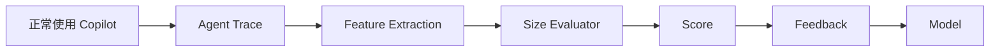
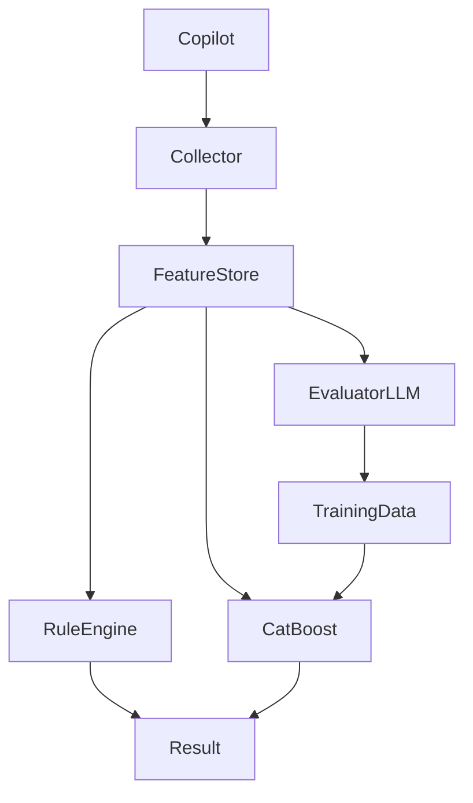
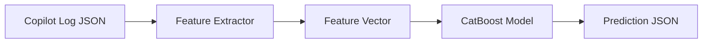
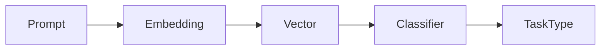
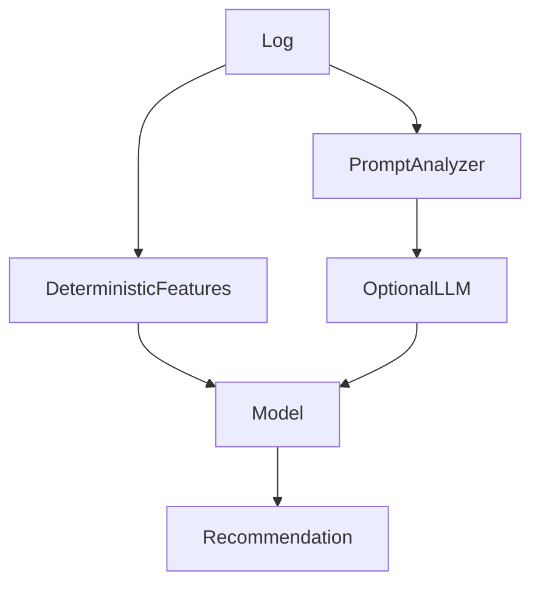
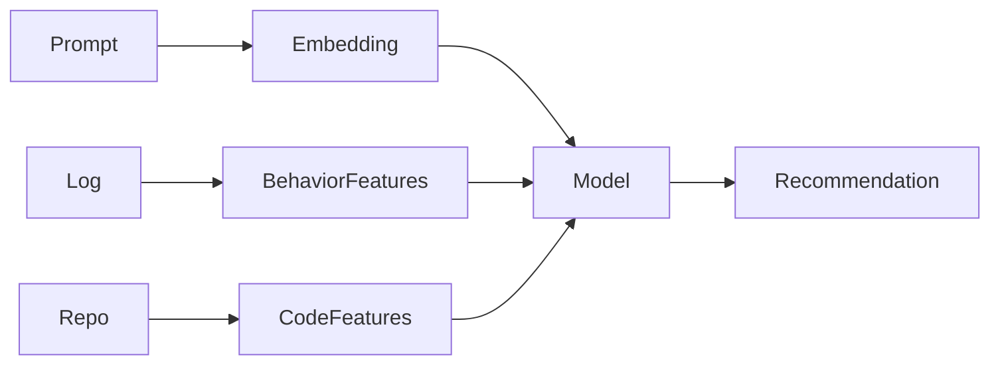

有一些现成工具，但要区分两个方向：

1. **Agent 使用情况 / Token / Cost / Tool 调用监控** —— 已经有不少。
2. **判断“当前模型是否过强，应该降级到便宜模型”** —— 基本还没有成熟开源方案。

你前面设想的那个 **Model Right-Sizing Advisor**，目前仍然属于比较新的方向。

---

## 已有项目（接近你的需求）

### 1. TokenTelemetry（最接近 Agent Observability）

[TokenTelemetry](https://tokentelemetry.com/?utm_source=chatgpt.com)

它做：

* Claude Code
* Codex
* Cursor
* Gemini CLI
* GitHub Copilot 等 Agent

的：

* token 使用
* cost
* tool calls
* session 分析
* 本地 dashboard

它的架构和你想做的前半部分非常接近：

```
local logs
    |
parser
    |
metrics
    |
dashboard
```

但是：

❌ 不做模型推荐
❌ 不判断任务复杂度
❌ 不告诉你 "GPT-5 mini 是否够用"

([TokenTelemetry][1])

---

### 2. SuperBased Observer

[SuperBased Observer](https://superbased.app/?utm_source=chatgpt.com)

方向也是：

* 多 Agent
* 本地观察
* cost
* session
* pattern

更偏：

> "我的 AI coding agent 到底干了什么？"

而不是：

> "我是不是用了过大的模型？"

([superbased.app][2])

---

### 3. Copilot Usage Dashboard

有一些 VS Code Extension：

例如：

Copilot Usage Dashboard

主要分析：

* token
* model
* session
* cost
* tool/subagent

([Reddit][3])

GitHub 官方也提供 Copilot Usage Metrics：

* model usage
* chat mode usage
* adoption
* language breakdown

但主要面向 Enterprise 管理，不分析单次 Agent 行为质量。([GitHub Docs][4])

---

# 你想做的缺口在哪里？

你的目标实际上是：

```
输入:

Agent Trace

↓

Feature Extraction

↓

Task Complexity Model

↓

Recommendation


GPT-5
  |
  |-- 是否浪费？
  |
GPT-5-mini
  |
  |-- 成功概率？
```

这属于：

## AI Coding Agent Optimization

目前还没有类似：

> "你的这次任务用了 Claude Opus，其实 Sonnet 就够"

这种成熟工具。

---

# 为什么没人做好？

因为需要一个关键数据：

## Counterfactual Data（反事实数据）

比如：

同一个任务：

```
Task A

GPT-5:
成功

成本:
$0.50


GPT-5-mini:
成功?

成本:
$0.08
```

只有这个数据才能真正训练：

```
P(success | model, task features)
```

但是现实中：

用户不会同时跑两个模型。

所以缺训练标签。

---

# 目前最现实的方法

不是训练：

```
task -> best model
```

而是训练：

```
task features -> complexity score
```

例如：

```
Complexity:

18/100

建议:

Mini

confidence:

85%
```

这个容易很多。

---

# 如果我做这个项目，会这样定位

不是：

> Model Selector

而是：

> Agent Efficiency Advisor

因为它更容易落地。

输出：

```
Session #1024

Model:
GPT-5

Cost:
$0.38


Analysis:

Context:
22%

Tool Calls:
3

Files:
1


Recommendation:

This task resembles
423 previous tasks.

92% completed successfully
with GPT-5-mini.


Potential saving:

$0.27
```

这才是真正有价值的。

---

所以总结：

| 能力              | 现状      |
| --------------- | ------- |
| Token 统计        | ✅ 很多    |
| Cost 分析         | ✅ 很多    |
| Tool 调用分析       | ✅ 开始成熟  |
| Agent Trace 可视化 | ✅ 有     |
| Context 膨胀检测    | ⚠️ 少    |
| Tool Loop 检测    | ⚠️ 少    |
| 自动推荐便宜模型        | ❌ 基本空白  |
| 基于历史学习最佳模型      | ❌ 几乎没人做 |

你前面设计的方向，其实是在现有 Token/Cost Dashboard 上再向前推进一层，属于一个明显的空白区。

[1]: https://tokentelemetry.com/?utm_source=chatgpt.com "Token Telemetry — Observability for coding & autonomous agents (Hermes, Claude Code, Codex …)"
[2]: https://superbased.app/?utm_source=chatgpt.com "SuperBased Observer — See what your AI coding agent is actually doing."
[3]: https://www.reddit.com/r/GithubCopilot/comments/1tu7agd/github_copilot_usage_extension_with_ai_credits/?utm_source=chatgpt.com "Github Copilot Usage Extension with AI Credits"
[4]: https://docs.github.com/en/copilot/how-tos/administer-copilot/view-usage-and-adoption?utm_source=chatgpt.com "Viewing the Copilot usage metrics dashboard - GitHub Docs"


----------


这个方向可行，但**不要在用户正常工作流里强制做“双跑模型”**（例如同一个任务同时调用 GPT-5 和 GPT-5-mini），成本和体验都不可接受。

更好的方式是做 **implicit evaluation（隐式评估）**：用户正常使用 Agent 时，收集 execution trace 和 outcome signals，然后估计“这个任务是否被过大的模型解决”。

---

## 目标重新定义

不要问：

> GPT-5 能不能换成 GPT-5-mini？

因为你没有 counterfactual。

改成：

> 根据历史任务特征和结果，预测更小模型完成类似任务的成功概率。

流程：



---

# 方法 1：插入轻量 Prompt，让 Agent 自评（推荐）

在 Agent 完成后，不影响用户，只增加一个后台评估步骤。

例如生成一个隐藏评估请求：

```
You are an AI coding task evaluator.

Given this completed agent trace:

- user request
- files changed
- tool calls
- reasoning steps metadata
- final diff

Estimate:

1. Task complexity: 1-10
2. Could a smaller model likely solve it?
3. Confidence
4. Reasons

Return JSON only.
```

输出：

```json
{
  "complexity": 3,
  "smaller_model_possible": true,
  "confidence": 0.87,
  "reason": [
    "single file edit",
    "no architectural reasoning",
    "few tool calls"
  ]
}
```

注意：

这个调用应该：

* 异步
* 使用便宜模型
* 不阻塞用户

例如：

```text
GPT-5完成任务

↓

后台

GPT-5-mini evaluator

↓

记录结果
```

---

# 方法 2：让用户无感采集 outcome signal

真正重要的是知道：

> 任务是否成功。

可以收集：

## 正向信号

例如：

* Agent 完成后用户继续编辑很少
* 没有 revert
* git diff 被 commit
* 测试通过
* 下一次 prompt 没有纠正

定义：

```ts
successScore =
    testPassed * 0.4 +
    commit * 0.3 +
    noRetry * 0.2 +
    noRevert * 0.1
```

---

## 负向信号

例如：

```text
Agent edit

↓

用户马上：

"no, change it"

↓

重新修改
```

说明：

模型能力不足。

---

# 方法 3：Shadow Evaluation（最好但成本高）

抽样。

例如：

每 100 个任务：

随机选 5 个。

复制：

```text
Original:

GPT-5


Shadow:

GPT-5-mini
```

后台运行。

比较：

```text
GPT-5

成功


GPT-5-mini

成功
```

得到真实标签。

这是真正训练数据。

但是：

成本高。

---

# 方法 4：生成训练数据

这是很多团队会采用的方式：

### 第一阶段

LLM 做 Teacher：

```
GPT-5 trace

↓

Evaluator

↓

Label:

"mini sufficient"
```

生成：

```json
{
features:{
 context:12000,
 tools:5,
 files:2
},

label:
"mini"
}
```

---

### 第二阶段

训练：

```
CatBoost

features -> model size
```

---

### 第三阶段

线上：

```
Copilot log

↓

Feature

↓

CatBoost

↓

Recommendation
```

不再调用 LLM。

---

# Prompt 放在哪里？

不要修改用户 prompt。

不要：

```
用户问题

+
评估prompt
```

这样污染上下文。

应该：

## Option A：独立 evaluator call

```
Agent session

       |
       |
       v

Evaluation Worker

       |
       v

small model
```

---

## Option B：利用 VS Code Extension

监听：

```text
onAgentCompleted()
```

然后：

```ts
evaluate(trace)
```

---

# 最终推荐架构



---

## 实际落地顺序

我会这样做：

### V1

纯日志：

* token
* context
* tool
* cost
* diff

### V2

加入 evaluator prompt：

每天抽样分析：

* complexity
* smaller model possible

### V3

积累 1~5 万样本：

训练 CatBoost。

### V4

实时提示：

> “当前任务类似过去 1200 个任务，其中 94% 使用 mini 成功。”

---

关键点：

**不要让用户额外参与评估。**

让用户正常写代码，Agent trace 本身就是数据源；通过后台 evaluator + 少量 shadow test 产生标签，最终训练出本地模型。这和推荐系统、风控系统里的“在线行为采集 → 离线训练 → 在线预测”模式非常类似。


-------------

可以。**训练后的模型本质上就是一个函数：`features -> prediction`**，只要你的 JSON 能转换成训练时一致的 feature vector，就可以直接判断。

例如训练时定义：

```json
{
  "contextTokens": 12000,
  "toolCalls": 8,
  "filesTouched": 2,
  "diffLines": 150,
  "retryCount": 1,
  "taskType": "bugfix"
}
```

模型输出：

```json
{
  "recommendedModel": "gpt-5-mini",
  "confidence": 0.91,
  "probabilities": {
    "gpt-5-mini": 0.91,
    "gpt-5": 0.09
  }
}
```

---

## 典型流程



注意：

**不要直接把原始日志 JSON 喂给 CatBoost。**

应该：

```
main.jsonl
    |
    v
Feature Extraction
    |
    v
{
 contextRatio:0.35,
 toolCount:12,
 editFiles:3
}
    |
    v
Model
```

---

## CatBoost 示例

训练：

```python
from catboost import CatBoostClassifier

model = CatBoostClassifier(
    loss_function="MultiClass"
)

model.fit(
    X_train,
    y_train,
    cat_features=[
        "taskType",
        "language"
    ]
)

model.save_model("agent-model.cbm")
```

预测：

```python
model.load_model("agent-model.cbm")

result = model.predict_proba(
    [
        [
            12000,
            8,
            2,
            150,
            1,
            "bugfix"
        ]
    ]
)
```

输出：

```
[
 [0.91, 0.08, 0.01]
]
```

---

## 如果你的运行环境是 JS

有几个方案。

### 方案 1：Python 服务（最简单）

架构：

```mermaid id="7m2v5d"
VS Code Extension

        |
        HTTP

        v

Python FastAPI

        |
        v

CatBoost Model
```

优点：

* 开发最快
* CatBoost 原生支持

缺点：

* 多一个进程

---

### 方案 2：导出 ONNX（更适合你的场景）

训练：

```
CatBoost
    |
    v
ONNX
```

VS Code Extension：

```bash
npm install onnxruntime-node
```

然后：

```ts
const result =
 await session.run({
   features:tensor
 });
```

优点：

* 本地运行
* 无 Python
* 隐私好
* 发布简单

---

### 方案 3：直接 JS 实现树推理

GBDT 本质：

```
if feature < threshold
    go left
else
    go right
```

所以理论上可以：

```
model.json

↓

TypeScript TreeEvaluator

↓

prediction
```

一些项目会这么做。

---

## 对你的 Copilot Agent Observer，我会这样设计

模型文件：

```
models/

 agent-size-v1.onnx

 feature-schema.json

 label-map.json
```

输入：

```json
{
 "model":"gpt-5",
 "contextTokens":45000,
 "toolCalls":18,
 "readFiles":30,
 "editedFiles":4,
 "retryRate":0.05,
 "taskType":"refactor"
}
```

内部转换：

```ts
FeatureExtractor.extract(json)
```

得到：

```json
[
0.35,
18,
30,
4,
0.05,
2
]
```

模型：

```
ONNX Runtime
```

输出：

```json
{
 "recommendation":"gpt-5-mini",
 "confidence":0.87
}
```

---

还有一个很重要的工程点：

**feature schema 必须版本化。**

例如：

```json
{
 "version":3,
 "features":[
   "contextRatio",
   "toolCount",
   "retryRate"
 ]
}
```

否则模型升级后，旧客户端输入顺序错了，结果会完全错误。

所以答案是：

> 是的，训练后的模型可以直接根据 JSON 判断；但生产系统通常是 JSON → Feature Extractor → Model → Prediction，而不是 JSON 直接进入模型。对于你的 VS Code Agent Observability 场景，ONNX + TypeScript 推理会是比较理想的部署方式。


-----------


不一定。**大部分情况下不需要 LLM。**

关键看你说的“转换”是哪一种。

---

## 1. JSON Log → Feature Vector：不需要 LLM（推荐）

这是确定性的 ETL。

例如 Copilot log：

```json
{
  "toolCalls": [
    {"name":"readFile"},
    {"name":"editFile"}
  ],
  "files":["a.ts","b.ts"],
  "tokens":45000
}
```

转换：

```ts
{
  contextRatio: 0.35,
  toolCallCount: 2,
  readFileCount: 1,
  editFileCount: 1,
  filesTouched: 2
}
```

代码即可：

```ts
function extractFeatures(log): Features {
    return {
        contextRatio:
            log.tokens / 128000,

        toolCalls:
            log.toolCalls.length,

        edits:
            countTool(log, "editFile")
    };
}
```

这类 Feature：

* token 数
* tool 数
* 文件数
* diff 大小
* retry 次数
* latency
* context 增长速度

全部不需要 AI。

---

## 2. Prompt 内容 → Task Type：可能需要 LLM

例如：

用户：

> "帮我把支付模块重构一下，支持多币种结算"

你想判断：

```json
{
 "taskType":"architecture_refactor",
 "complexity":8
}
```

这里涉及语义理解。

有三个选择：

### A. LLM 分类（效果最好）

```text
Classify this coding task:

{text}

Return JSON:
{
 taskType,
 complexity
}
```

准确，但成本高。

---

### B. Embedding + 分类模型（推荐长期方案）

流程：



例如：

* OpenAI embedding
* BGE
* E5

然后：

* KNN
* Logistic Regression
* CatBoost

不需要每次调用 LLM。

---

### C. 规则

简单任务：

```text
"explain"
"document"
"rename"
"fix typo"
```

直接规则即可。

---

## 3. 最佳实践：混合方案

我会这样设计：



其中：

### 90%

不用 LLM：

```
tokens
tools
files
diff
retry
context
latency
```

### 10%

LLM：

```
task intent
architecture complexity
ambiguity
```

---

## 4. 甚至可以让 ML 替代 LLM

例如早期：

用 LLM 标注：

```
10000 个任务

prompt
 ↓
LLM

label:
bugfix
refactor
architecture
```

得到训练集。

然后：

```
embedding + classifier

替代 LLM
```

线上：

```
Prompt
 ↓
Embedding model
 ↓
Classifier
 ↓
Task type
```

成本接近零。

---

## 针对你的 Agent Model Size Evaluator，我建议：

第一版：

```
Copilot Log
    |
    |
    +-- deterministic extractor
    |
    +-- 简单规则 task classifier
    |
    v
CatBoost
    |
    v
Model recommendation
```

不要引入 LLM。

第二版：

加入：

```
Prompt embedding
```

第三版：

只有低置信度：

```
Classifier confidence < 60%

        ↓

LLM judge
```

这样成本最低，而且系统会随着数据积累越来越智能。

所以结论：

**JSON → Feature Vector 不需要 LLM；只有从自然语言 Prompt 中提取“任务语义”时，LLM 或 embedding 才有价值。**


-------------

会，而且这是**必然会发生的**。Embedding 很适合做“语义相似度”和“粗粒度分类”，但它不是一个可靠的“任务复杂度判断器”。

关键区别：

> Embedding 能回答：“这个任务像哪些历史任务？”
>
> 但不擅长回答：“这个任务需要多强的推理能力？”

---

## 一个例子

两个 Prompt：

### A

> 修复登录接口返回 500 的问题

### B

> 重构认证系统，支持 OAuth2、多租户权限模型，并迁移现有用户体系

Embedding 可能认为：

```text
相似度很高

login
authentication
user
security
```

但是实际复杂度：

```text
A:
3/10

B:
9/10
```

因为复杂度来自：

* 影响范围
* 架构决策
* 风险
* 隐含约束

这些不是单纯语义。

---

## 为什么 Embedding 会误判？

### 1. 语义相似 ≠ 推理难度

Embedding 空间通常优化：

```
meaning similarity
```

不是：

```
required intelligence
```

例如：

```
"explain this function"
```

和

```
"rewrite this compiler optimization pass"
```

可能有相似词：

* function
* code
* optimize

但难度完全不同。

---

### 2. 缺少执行上下文

Prompt：

> "fix this bug"

Embedding 无法知道：

* 修改几个文件？
* repo 多大？
* 是否需要理解架构？
* 测试是否通过？

而 Agent log 有：

```
readFile: 150
grep: 80
edit: 3
diff: 5000 lines
```

这些往往比 Prompt 更能判断模型需求。

---

### 3. 长任务信息被压缩

Embedding 是一个固定长度向量：

例如：

```
20,000 tokens

↓

1536 dimensions
```

必然丢信息。

---

# 更好的方式：Embedding + 行为 Feature

不要：

```
Prompt Embedding
        |
        v
模型选择
```

而应该：



Feature：

```ts
interface AgentFeatures {

    // semantic
    promptEmbedding:number[]

    // execution
    toolCalls:number
    filesRead:number
    filesChanged:number

    // complexity
    diffLines:number
    dependencyChanges:number

    // efficiency
    retries:number
    contextGrowth:number

}
```

---

# 实际准确率排序

对于判断“模型是否过强”：

| 方法                                 | 可靠性    |
| ---------------------------------- | ------ |
| 只看 Prompt Embedding                | ⭐⭐     |
| Prompt + Rule                      | ⭐⭐⭐    |
| Log Feature + CatBoost             | ⭐⭐⭐⭐   |
| Log Feature + Embedding + CatBoost | ⭐⭐⭐⭐⭐  |
| 双模型 Shadow Test                    | ⭐⭐⭐⭐⭐⭐ |

---

# 一个更现实的方案：预测“成功概率”

不要预测：

```
应该用 GPT-5 mini
```

这个太难。

预测：

```
GPT-5-mini 完成该任务成功概率 = 92%
```

然后：

```
if mini_success > 90%
    recommend mini
else
    keep large
```

训练数据更容易。

---

# 另外一个很重要的信号：Agent 行为本身

其实 Agent 自己告诉你复杂度。

例如：

简单任务：

```
readFile 2
edit 1
test pass
```

复杂任务：

```
readFile 200
grep 80
sub-agent 3
retry 5
context 180k
```

这些执行轨迹（trace）通常比 Prompt 更可靠。

---

所以在你的 Copilot Agent Observability 场景，我不会把 Embedding 放在核心位置。

推荐权重：

```
Agent Execution Features   60%
Repository/Code Features   25%
Prompt Embedding           15%
```

Embedding 作为语义补充，而不是决策核心。这样误判率会明显低很多。


-----------


如果只用 **Embedding** 做类似判断，成本会低很多，甚至可以做到接近免费。

不过要先明确：Embedding 不是直接输出：

> “应该用 GPT-5 mini”

而是做：

* Prompt/Task 相似度
* 找历史相似任务
* 聚类
* 作为 CatBoost 的输入特征

---

## 假设场景

每个 Agent session：

* 原始日志很大
* 经过压缩，只取：

```json
{
 "prompt": "Refactor authentication module...",
 "summary": "Changed 5 files, added OAuth flow",
 "error": "JWT validation failed"
}
```

假设：

```
1000 tokens/session
```

---

## OpenAI embedding 成本

例如 `text-embedding-3-small`：

* $0.02 / 1M tokens ([OpenAI 开发者][1])

计算：

### 单次

```text
1000 / 1,000,000 * 0.02

= $0.00002
```

也就是：

```
0.002 美分
```

---

### 一万次

```text
10000 * 0.00002

= $0.2
```

约：

```
20 美分
```

---

## 即使 50 倍 token

你前面说 GPT evaluator 至少 50 倍：

Embedding：

```
50000 tokens/session
```

成本：

单次：

```
50000 / 1M * 0.02

= $0.001
```

一万次：

```
$10
```

---

## 对比 GPT evaluator

刚才估算：

| 方法                     |     1万次 |
| ---------------------- | ------: |
| GPT-5.4 mini evaluator | ~$1000+ |
| Embedding              | <$1~$10 |
| 本地 embedding model     |   接近 $0 |

差距大约：

**100倍以上。**

---

## 但是能力不同

### Embedding 可以做：

很好：

```
当前任务
   |
   v
找到历史类似任务

过去1000次:

90% mini成功

=> 推荐 mini
```

这是类似：

```text
nearest neighbor recommendation
```

---

### Embedding 不擅长：

直接判断：

```
这个任务需要多少推理能力？
```

例如：

两个任务：

```
"refactor payment service"
```

Embedding 很接近。

但是：

A:

```text
拆分一个300行service
```

B:

```text
重新设计支付领域模型
```

复杂度差很多。

---

## 我认为最佳架构

其实不需要 CatBoost 第一版。

可以：


例如：

存：

```json
{
 embedding:[...],

 model:"gpt-5",

 success:true,

 cost:0.32,

 complexity:7
}
```

新任务：

1. embedding
2. 找 Top-K 相似任务
3. 看历史结果

输出：

```
类似任务 327 个

GPT-5-mini:
成功率 94%

平均成本:
$0.04

推荐:
GPT-5-mini
```

---

## 甚至比 ML 更容易落地

因为你不需要训练：

* 没有 label
* 没有模型维护
* 数据增长自动生效

这是典型：

> Retrieval-based Recommendation

---

## 我的建议路线

针对你的 Copilot Observer：

### V1

Embedding + SQLite/DuckDB

不用 ML：

```
log
 |
embedding
 |
similar tasks
 |
recommendation
```

成本极低。

---

### V2

积累数据：

```
embedding
+
execution features

↓

CatBoost
```

---

### V3

边界情况：

```
embedding + CatBoost confidence低

↓

GPT evaluator
```

---

所以如果目标是**低成本验证模型选择器想法**，我反而会先做：

> Embedding + 历史任务检索 + 成功率统计

而不是一开始训练 CatBoost。

它可能已经能解决 70% 的“这个模型是不是用大了”的问题。

[1]: https://developers.openai.com/api/docs/models/text-embedding-3-small?utm_source=chatgpt.com "text-embedding-3-small Model | OpenAI API"


-------------


这正是**最大的难点**，也是为什么这个问题不能只靠 Embedding 或 ML 解决。

如果你的历史数据**全部都是同一个模型**（例如一直用 GPT-5），那么你实际上缺少了最关键的信息：

> **Counterfactual（反事实）**：如果当时用 GPT-5 mini，会不会也成功？

举个例子：

| Task | 使用模型  | 成功 |
| ---- | ----- | -- |
| A    | GPT-5 | ✅  |
| B    | GPT-5 | ✅  |
| C    | GPT-5 | ✅  |

你**不能**训练出：

> A 应该用 GPT-5 mini。

因为训练数据里从来没有 GPT-5 mini 的结果。

---

## 为什么？

你的数据只有：

```text
X (任务特征)
↓

Y = 成功
```

缺少：

```text
X

+

Model

↓

Success
```

也就是说，你没有模型这个变量的对照。

---

## 机器学习角度

真正应该学习的是：

```text
P(success | features, model)
```

而你现在只有：

```text
P(success | features, GPT-5)
```

因此模型永远学不会：

> 换成 GPT-5 mini 会怎样。

---

# 怎么解决？

## 方案一：探索（Exploration）——推荐

这是推荐系统和强化学习里的经典方法。

例如：

95%：

```text
继续 GPT-5
```

5%：

```text
随机试 GPT-5 mini
```

收集：

| Task | Model      | Success |
| ---- | ---------- | ------- |
| A    | GPT-5      | ✅       |
| A'   | GPT-5 mini | ✅       |

这样慢慢就有标签了。

这其实就是 **Multi-Armed Bandit** 的思想。

---

## 方案二：Shadow Run（最准确）

后台偷偷运行：

```text
用户

↓

GPT-5

↓

成功
```

同时：

```text
后台

↓

GPT-5 mini

↓

不影响用户
```

比较：

* 是否完成
* diff 是否相似
* 是否通过测试

得到真实标签。

缺点：

贵。

---

## 方案三：LLM Teacher（我最推荐）

没有 GPT-5 mini 数据。

那就让 GPT-5 当老师。

例如：

```
下面是一个已经完成的 Agent Trace。

请判断：

如果换成 GPT-5 mini，
成功概率是多少？

为什么？

返回 JSON。
```

得到：

```json
{
  "mini_success_probability": 0.93,
  "reason": [
    "single file",
    "simple bug fix"
  ]
}
```

虽然不是真实标签，但可以作为**弱监督（Weak Label）**。

然后训练 CatBoost。

这是工业界非常常见的做法。

---

## 方案四：Outcome Signals（推荐结合）

不要只看模型。

还看：

```text
Agent 完成

↓

测试通过？

↓

用户有没有重新修改？

↓

有没有 rollback？

↓

有没有继续问：

"不对，再改一下"
```

如果：

```
GPT-5

↓

一次成功

↓

没有返工
```

只能说明：

GPT-5 足够。

不能说明：

GPT-5 mini 不够。

---

# Embedding 能解决吗？

不能。

Embedding 可以找到：

```text
最像的历史任务
```

但是：

如果历史任务全部：

```
GPT-5
```

那么结果永远是：

```
历史都用 GPT-5。
```

没有任何比较价值。

---

# 我觉得最现实的方案

如果我是做这个产品，我会这样设计：

```mermaid
flowchart LR

Log

-->

Feature

-->

Similarity Search

-->

Rule Engine

-->

Need Evaluation?

Need Evaluation?

-->|No| Recommendation

Need Evaluation?

-->|Yes| Background Teacher LLM

Background Teacher LLM

-->

Training Dataset

-->

CatBoost
```

也就是说：

* **99% 的任务**：直接规则 + 相似任务推荐。
* **只有新类型、边界类型**：后台让一个便宜模型做 Teacher 标注。
* **积累足够多后**：训练本地模型。

---

## 还有一种值得考虑的思路

如果你的目标是帮助用户省钱，而不是发表机器学习论文，可以把推荐的表达改成：

> **"根据当前任务特征，缺乏直接证据证明必须使用 GPT-5。建议下次尝试 GPT-5 mini。"**

也就是说，不宣称：

> "GPT-5 mini 一定够。"

而是：

> "这是一个低风险的降级候选（Low-risk downgrade candidate）。"

这种建议不需要证明 GPT-5 mini 一定成功，只需要证明**当前任务没有明显表现出需要大模型的特征**（例如没有长规划、没有大量工具调用、没有复杂多文件重构等）。在工程实践中，这种保守、可解释的推荐往往比一个看似精确但缺乏真实对照数据的分类器更可靠。
