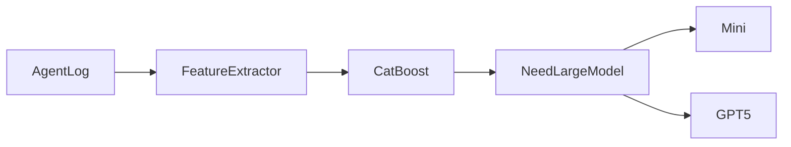

github copilot的auto 模式，怎么实现的


这正是**最大的难点**，也是为什么这个问题不能只靠 Embedding 或 ML 解决。

如果你的历史数据**全部都是同一个模型**（例如一直用 GPT-5），那么你实际上缺少了最关键的信息：

> **Counterfactual（反事实）**：如果当时用 GPT-5 mini，会不会也成功？

举个例子：

| Task | 使用模型  | 成功 |
| ---- | ----- | -- |
| A    | GPT-5 | ✅  |
| B    | GPT-5 | ✅  |
| C    | GPT-5 | ✅  |

你**不能**训练出：

> A 应该用 GPT-5 mini。

因为训练数据里从来没有 GPT-5 mini 的结果。

---

## 为什么？

你的数据只有：

```text
X (任务特征)
↓

Y = 成功
```

缺少：

```text
X

+

Model

↓

Success
```

也就是说，你没有模型这个变量的对照。

---

## 机器学习角度

真正应该学习的是：

```text
P(success | features, model)
```

而你现在只有：

```text
P(success | features, GPT-5)
```

因此模型永远学不会：

> 换成 GPT-5 mini 会怎样。

---

# 怎么解决？

## 方案一：探索（Exploration）——推荐

这是推荐系统和强化学习里的经典方法。

例如：

95%：

```text
继续 GPT-5
```

5%：

```text
随机试 GPT-5 mini
```

收集：

| Task | Model      | Success |
| ---- | ---------- | ------- |
| A    | GPT-5      | ✅       |
| A'   | GPT-5 mini | ✅       |

这样慢慢就有标签了。

这其实就是 **Multi-Armed Bandit** 的思想。

---

## 方案二：Shadow Run（最准确）

后台偷偷运行：

```text
用户

↓

GPT-5

↓

成功
```

同时：

```text
后台

↓

GPT-5 mini

↓

不影响用户
```

比较：

* 是否完成
* diff 是否相似
* 是否通过测试

得到真实标签。

缺点：

贵。

---

## 方案三：LLM Teacher（我最推荐）

没有 GPT-5 mini 数据。

那就让 GPT-5 当老师。

例如：

```
下面是一个已经完成的 Agent Trace。

请判断：

如果换成 GPT-5 mini，
成功概率是多少？

为什么？

返回 JSON。
```

得到：

```json
{
  "mini_success_probability": 0.93,
  "reason": [
    "single file",
    "simple bug fix"
  ]
}
```

虽然不是真实标签，但可以作为**弱监督（Weak Label）**。

然后训练 CatBoost。

这是工业界非常常见的做法。

---

## 方案四：Outcome Signals（推荐结合）

不要只看模型。

还看：

```text
Agent 完成

↓

测试通过？

↓

用户有没有重新修改？

↓

有没有 rollback？

↓

有没有继续问：

"不对，再改一下"
```

如果：

```
GPT-5

↓

一次成功

↓

没有返工
```

只能说明：

GPT-5 足够。

不能说明：

GPT-5 mini 不够。

---

# Embedding 能解决吗？

不能。

Embedding 可以找到：

```text
最像的历史任务
```

但是：

如果历史任务全部：

```
GPT-5
```

那么结果永远是：

```
历史都用 GPT-5。
```

没有任何比较价值。

---

# 我觉得最现实的方案

如果我是做这个产品，我会这样设计：

```mermaid
flowchart LR

Log

-->

Feature

-->

Similarity Search

-->

Rule Engine

-->

Need Evaluation?

Need Evaluation?

-->|No| Recommendation

Need Evaluation?

-->|Yes| Background Teacher LLM

Background Teacher LLM

-->

Training Dataset

-->

CatBoost
```

也就是说：

* **99% 的任务**：直接规则 + 相似任务推荐。
* **只有新类型、边界类型**：后台让一个便宜模型做 Teacher 标注。
* **积累足够多后**：训练本地模型。

---

## 还有一种值得考虑的思路

如果你的目标是帮助用户省钱，而不是发表机器学习论文，可以把推荐的表达改成：

> **"根据当前任务特征，缺乏直接证据证明必须使用 GPT-5。建议下次尝试 GPT-5 mini。"**

也就是说，不宣称：

> "GPT-5 mini 一定够。"

而是：

> "这是一个低风险的降级候选（Low-risk downgrade candidate）。"

这种建议不需要证明 GPT-5 mini 一定成功，只需要证明**当前任务没有明显表现出需要大模型的特征**（例如没有长规划、没有大量工具调用、没有复杂多文件重构等）。在工程实践中，这种保守、可解释的推荐往往比一个看似精确但缺乏真实对照数据的分类器更可靠。


------


有，而且这几年这个方向已经形成了一个研究领域，叫：

> **LLM Routing / Model Routing / Query Routing**

不过要注意，它们的目标和你的项目略有不同。

你的目标：

> **根据 Agent 行为判断："这个任务是否可以用更便宜的模型？"**

而大部分项目是：

> **根据 Prompt 判断："这个请求应该发给哪个模型？"**

不过底层算法几乎一样。

---

# 1. RouteLLM ⭐⭐⭐⭐⭐（最值得研究）

**GitHub：RouteLLM**（LMSYS）[RouteLLM GitHub](https://github.com/lm-sys/routellm?utm_source=chatgpt.com)

这是目前最有影响力的开源项目之一，也是我最推荐你看的。

它的核心思想：

```mermaid
flowchart LR

Prompt

-->

Router

-->

Small Model

Router

-->

Large Model
```

特点：

* 已训练好的 Router
* OpenAI Compatible API
* 成本可降低约 **85%**
* 维持接近 GPT-4 的质量([GitHub][1])

更重要的是，它不是只有一种算法，而是内置了多个 Router。

例如：

| Router               | 算法       |
| -------------------- | -------- |
| Matrix Factorization | ⭐ 推荐     |
| BERT Classifier      | 文本分类     |
| Weighted Elo Ranking | 排名模型     |
| LLM Classifier       | LLM 做判断  |
| Random               | Baseline |

([GitHub][1])

也就是说：

**别人已经证明了：Router 完全可以不是 LLM。**

---

# 2. LLMRouter（UIUC）

**GitHub：LLMRouter**[LLMRouter GitHub](https://github.com/ulab-uiuc/LLMRouter?utm_source=chatgpt.com)

这是一个偏研究的平台。

它把几乎所有 Routing 方法都实现了。

支持：

* KNN
* SVM
* MLP
* Matrix Factorization
* Elo
* BERT
* Graph
* Hybrid

甚至还有：

* Personalized Router
* RL Router
* Multi-turn Router

([GitHub][2])

如果你以后想实验：

> CatBoost vs SVM vs KNN

它很有参考价值。

---

# 3. Semantic Router

**GitHub：semantic-router**（Aurelio）[semantic-router GitHub](https://github.com/aurelio-labs/semantic-router?utm_source=chatgpt.com)

它的思想和你很像。

不是：

```text
LLM 判断
```

而是：

```text
Embedding

↓

Semantic Decision

↓

Tool

↓

Model
```

主要用途：

* Tool Selection
* Intent Detection
* Agent Routing

速度非常快。

([GitHub][3])

---

# 4. vLLM Semantic Router

这个更偏系统。

例如：

```
Prompt

↓

Signal

↓

Rule

↓

Model
```

Signal 包括：

* Context Length
* Task
* Complexity
* Tool
* Language

甚至：

* PII
* Safety
* Authorization

然后：

```
Signal

↓

Policy

↓

Model
```

它其实就是：

> Rule + ML + Semantic

([arXiv][4])

---

# RouteLLM 最值得你看的地方

RouteLLM 最大贡献不是代码。

而是：

## 它解决了你的问题。

他们训练的是：

```
Prompt

↓

Router

↓

Strong

Weak
```

而不是：

```
Prompt

↓

LLM

↓

Strong?

Weak?
```

Router 可以：

* Matrix Factorization
* BERT
* Ranking

根本不用 GPT。

---

# 和你的项目最大的区别

你的输入其实更丰富。

RouteLLM：

```
Prompt
```

↓

Router

你的：

```
Prompt

+

Agent Log

+

Context

+

Tool Calls

+

Diff

+

Repository
```

↓

Router

所以理论上：

**你的准确率应该更高。**

---

# 我觉得你应该借鉴什么？

如果我是你，我不会重新发明 Router。

我会直接借鉴 RouteLLM 的思想。

例如：



只不过：

RouteLLM Feature：

```
Prompt Embedding
```

你的 Feature：

```
Prompt Embedding

+

Tool Count

+

Context Ratio

+

Retry Ratio

+

Planning Depth

+

SubAgent Count
```

---

# 我认为还有一个创新点

我反而**不建议**做：

```
Prompt Router
```

因为已经很多人做了。

我建议做：

> **Agent Trace Router**

输入：

```json
{
  "toolCalls":18,
  "contextRatio":0.63,
  "subAgents":3,
  "retry":2,
  "filesEdited":5,
  "planningSteps":7,
  "promptEmbedding":[...]
}
```

输出：

```json
{
  "recommendedModel":"gpt-5-mini",
  "confidence":0.91,
  "estimatedSaving":"73%"
}
```

**目前我没有看到有成熟的开源项目专门利用完整 Agent Trace 做模型路由。** 现有项目大多停留在 Prompt Routing，而你这里多了 Agent 执行轨迹（Tool Calls、Context 演化、Planning 等），这是一个明显的信息增量，也更适合做成本优化。

[1]: https://github.com/lm-sys/routellm?utm_source=chatgpt.com "GitHub - lm-sys/RouteLLM: A framework for serving and evaluating LLM routers - save LLM costs without compromising quality · GitHub"
[2]: https://github.com/ulab-uiuc/LLMRouter?utm_source=chatgpt.com "GitHub - ulab-uiuc/LLMRouter: LLMRouter: An Open-Source Library for LLM Routing · GitHub"
[3]: https://github.com/aurelio-labs/semantic-router?utm_source=chatgpt.com "GitHub - aurelio-labs/semantic-router: Superfast AI decision making and intelligent processing of multi-modal data. · GitHub"
[4]: https://arxiv.org/abs/2603.04444?utm_source=chatgpt.com "vLLM Semantic Router: Signal Driven Decision Routing for Mixture-of-Modality Models"
