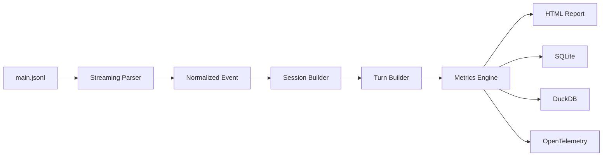

如果你打开的是 **GitHub Copilot Chat 的 Agent Debug Log / File Logging**，日志通常**不是**放在普通的 VS Code `logs` 目录，而是放在 **workspaceStorage** 下面。([Visual Studio Code][1])

### 最简单的方法（推荐）

按：

```text
Cmd/Ctrl + Shift + P
```

执行：

```text
Developer: Open Agent Debug Logs
```

或者：

```text
Developer: Open Extension Logs Folder
```

这是官方推荐的方法，会直接打开对应目录。([Visual Studio Code][1])

---

### macOS

如果开启了：

```json
"github.copilot.chat.agentDebugLog.fileLogging.enabled": true
```

日志一般位于：

```text
~/Library/Application Support/Code/User/workspaceStorage/<workspace-id>/
    GitHub.copilot-chat/
        debug-logs/
            <session-id>/
                main.jsonl
```

如果使用 **VS Code Insiders**：

```text
~/Library/Application Support/Code - Insiders/User/workspaceStorage/...
```

日志文件通常就是：

```text
main.jsonl
```

里面包含：

* Prompt
* Tool Calls
* MCP 调用
* Token 使用量
* 模型请求
* 响应
* Timing
* Errors

([Visual Studio Marketplace][2])

---

### Windows

```text
%APPDATA%\Code\User\workspaceStorage\<workspace-id>\GitHub.copilot-chat\debug-logs\
```

---

### Linux

```text
~/.config/Code/User/workspaceStorage/<workspace-id>/GitHub.copilot-chat/debug-logs/
```

---

### 如果找不到

可以直接搜索：

```bash
find ~/Library/Application\ Support/Code \
    -name main.jsonl
```

或者：

```bash
find ~/Library/Application\ Support/Code \
    -path "*GitHub.copilot-chat*"
```

---

如果你是想分析 **Copilot Agent** 的完整 Prompt、Context、Tool Calls、MCP 请求等，我也可以告诉你哪些字段最值得看，以及如何从 `main.jsonl` 中提取 Token、Prompt 和工具调用信息。

[1]: https://code.visualstudio.com/docs/agents/agent-troubleshooting/chat-debug-view?utm_source=chatgpt.com "Debug chat interactions"
[2]: https://marketplace.visualstudio.com/items?itemName=NadavLAN.token-coach&utm_source=chatgpt.com "Token Coach - Visual Studio Marketplace"


-------


完全可以，而且**比让 LLM 自己读日志更可靠、更便宜**。Copilot 的 `main.jsonl` 本身就是结构化 JSON Lines，非常适合做离线分析。

如果让我设计，我会把它做成一个 ETL Pipeline。



## 第一层：Streaming Parser

不要一次 `JSON.parse(readFileSync())`。

Node：

```ts
fs.createReadStream(...)
readline.createInterface(...)
```

Python：

```python
with open("main.jsonl") as f:
    for line in f:
        obj = json.loads(line)
```

几十 GB 都没问题。

---

## 第二层：统一事件模型

Copilot 会有很多 Event：

```ts
interface Event {
    type:
        | "session_start"
        | "turn_start"
        | "llm_request"
        | "tool_call"
        | "tool_result"
        | "child_session_ref"
        | ...
}
```

建议统一成自己的 Schema。

```ts
interface LLMRequest {
    model: string
    inputTokens: number
    outputTokens: number
    cachedTokens: number

    latency: number

    promptFile?: string
    toolsFile?: string

    requestId: string
}
```

这样以后 Copilot 升级日志格式也容易兼容。

---

## 第三层：重建 Session

真正有价值的是恢复执行流程。

```mermaid
sequenceDiagram

User->>Turn1

Turn1->>LLM
LLM-->>Tool A

Tool A-->>LLM

LLM-->>Tool B

Tool B-->>LLM

LLM-->>User
```

恢复：

* Session
* Turn
* Tool Call
* Tool Result
* Retry
* SubAgent
* Child Session

甚至可以生成完整调用树。

---

## 第四层：分析指标

例如：

### Token

```
Claude Sonnet

Input
Output
Cache
```

### Tool

```
readFile
grep
terminal
editFile

次数
耗时
失败率
```

### Prompt

统计：

```
system_prompt_0

↓

system_prompt_1

diff
```

### Cost

```
每 Turn

每 Agent

每天

每模型

累计费用
```

现在已经有人做到了。([Visual Studio Marketplace][1])

---

# Node.js 技术栈

你的技术栈更偏 TS，我建议：

```
readline
stream

↓

zod
```

做 Runtime Validation

↓

```
dayjs
```

时间处理

↓

```
duckdb
```

SQL 分析

↓

```
apache-arrow
```

导出

↓

```
echarts
```

HTML Dashboard

---

# Python 技术栈

```
json

↓

pandas

↓

polars（推荐）

↓

duckdb

↓

plotly
```

几乎不用写多少代码。

例如：

```
main.jsonl

↓

Polars LazyFrame

↓

group_by("model")

↓

sum(tokens)

↓

plotly
```

几十万行日志瞬间完成。

---

# 已有开源项目

目前已经出现不少相关项目：

1. **Copilot Local Usage**：统计请求数、Token 数、时间趋势，直接扫描 `main.jsonl`。([Visual Studio Marketplace][2])

2. **Copilot Cost Analyzer**：解析 `main.jsonl`、`system_prompt_x.json`、`tools_x.json`，计算每次请求成本、Prompt 变化和 Tool 使用情况。([Visual Studio Marketplace][1])

3. **Copilot Usage Dashboard**：提供按模型、Turn、Subagent 聚合的 Dashboard，并处理 `runSubagent-*.jsonl`、`title-*.jsonl` 等辅助日志。([Visual Studio Marketplace][3])

4. 一个 **Copilot Agent Log Parser** 示例项目，把 Agent 日志解析成 AST，适合研究复杂 Agent 执行流程。([Gist][4])

---

## 我更推荐的方向

如果只是统计 Token、Cost，这些项目已经做得不错。

但如果你想做一个真正有价值的工具，我更建议关注 **Agent Execution Replay（Agent 执行回放）**，例如：

* 可视化完整的 Tool Call DAG
* Prompt Diff（系统 Prompt / 用户 Prompt 演化）
* Context Window 增长曲线
* Token Hotspot（哪些文件、哪些工具最耗 Token）
* Retry、Loop、Subagent 关系图
* 一键导出为 Mermaid Sequence Diagram 或 OpenTelemetry Trace

目前这些能力基本还没有成熟的开源实现，而 Copilot 的日志已经包含了构建这类可视化所需的大部分信息。([github.com][5])

[1]: https://marketplace.visualstudio.com/items?itemName=SathvikCheela.copilot-cost-analyzer&utm_source=chatgpt.com "Copilot Cost Analyzer - Visual Studio Marketplace"
[2]: https://marketplace.visualstudio.com/items?itemName=josaphat.copilot-local-usage&utm_source=chatgpt.com "Copilot Local Usage - Visual Studio Marketplace"
[3]: https://marketplace.visualstudio.com/items?itemName=pvjagtap.copilot-usage-dashboard&utm_source=chatgpt.com "Copilot Usage Dashboard - Visual Studio Marketplace"
[4]: https://gist.github.com/Kreijstal/34795b9719a1cfd949bdc0e8ee0e4169?utm_source=chatgpt.com "Parse GitHub Copilot Agent Actions logs into a complete AST. Indentation-based scoping, nothing discarded — filter at render time, not parse time. · GitHub"
[5]: https://github.com/microsoft/vscode-copilot-chat/blob/main/docs/monitoring/agent_monitoring.md?utm_source=chatgpt.com "vscode-copilot-chat/docs/monitoring/agent_monitoring.md at main · microsoft/vscode-copilot-chat · GitHub"


----------


