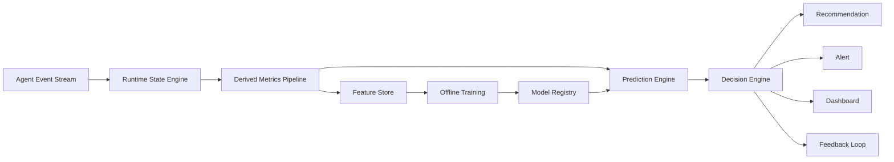

整体来看，这份文档已经不像一个 Demo，而是一个 **Agent Observability + AgentOps + Decision Engine** 的雏形。

不过，如果我是这个项目的架构负责人，我**不会继续往 Rule 或 CatBoost 上堆功能**，而是会把整个项目的定位提高一层。

目前最大的不足不是实现，而是**抽象层次还不够高**。

---

# 我认为下一阶段应该进入 V5

我会把 V5 定义为：

> **Agent Runtime Intelligence Platform**

目前的流程实际上还是：

```text
Log
   ↓
Session
   ↓
Rule
   ↓
Metrics
   ↓
Health
   ↓
Advisor
```

它更像日志分析。

真正的 Agent Runtime，应该维护的是：

```text
Agent Runtime State
```

而不是 Session。

也就是说：

```
事件
↓

State Machine

↓

Derived State

↓

Rule

↓

Prediction

↓

Recommendation
```

状态机应该成为整个系统的核心。

---

# 第一件建议：引入 Runtime State Machine

目前 SessionState 更像：

```
Counter
Counter
Counter
Counter
```

例如：

```
toolCalls++

promptTokens += xx

retry++

...
```

实际上缺少：

> Agent 当前正在干什么？

例如：

```
Idle

Planning

Thinking

CallingTool

WaitingTool

Editing

Reviewing

Finished

Failed
```

建议增加

```
stateDiagram-v2

[*] --> Planning

Planning --> ToolCalling

ToolCalling --> WaitingTool

WaitingTool --> Editing

Editing --> Reviewing

Reviewing --> Finished

Reviewing --> ToolCalling

Reviewing --> Failed
```

很多规则其实可以变成：

> 状态迁移异常

例如：

```
Planning

↓

Planning

↓

Planning

↓

Planning
```

说明 LLM 卡住了。

而不是：

```
retry >3
```

---

# 第二件建议：Event Sourcing

你现在：

```
SessionState
```

实际上是 Mutable。

我建议：

```
AgentEvent

↓

Reducer

↓

SessionSnapshot
```

完全 Event Sourcing。

例如

```
AgentEvent[]

↓

reduce()

↓

Snapshot
```

这样：

任何时候都可以：

```
Replay

Undo

Diff

Time Travel

Offline Analysis
```

ML 训练也直接读取 Event。

不用读各种统计值。

---

# 第三件建议：Plugin Architecture

目前：

```
Rule

Advisor

Metrics
```

都有自己的 Registry。

建议统一。

例如：

```
Plugin

├── EventConsumer
├── MetricsProvider
├── Rule
├── Predictor
├── DashboardWidget
└── Notifier
```

所有东西：

```
register(plugin)
```

即可。

例如：

```
Copilot Plugin

Claude Plugin

Cursor Plugin

Codex Plugin

```

甚至：

```
Jira Plugin

Git Plugin

CI Plugin
```

未来完全不用改 Core。

---

# 第四件建议：Derived Metrics Pipeline

现在：

```
Metrics.ts
```

里面会越来越长。

建议：

```
Event

↓

Derived Metric

↓

Feature

↓

Prediction
```

例如

```
ContextUsage

RetryRate

LoopProbability

FileEntropy

PromptGrowthRate

TokenVelocity

ToolSwitchRate

```

全部都是：

```
MetricProvider
```

实现。

类似：

```
Prometheus Exporter
```

的思想。

---

# 第五件建议：Prediction Pipeline

现在：

```
Advisor

↓

CatBoost
```

其实耦合了。

建议：

```
PredictionEngine

↓

Predictor[]

```

例如：

```
RulePredictor

MLPredictor

HeuristicPredictor

LLMPredictor

```

最终：

```
Voting

↓

Recommendation
```

以后：

甚至可以：

```
Mini says mini

Rule says medium

ML says mini

LLM says medium

↓

Confidence Fusion
```

---

# 第六件建议：Knowledge Graph

目前：

```
Session

↓

Events
```

实际上还有：

```
Files

Directories

Prompt

Model

Tool

Errors
```

建议建立：

```
Knowledge Graph
```

例如：

```
Session

↓

Tool

↓

File

↓

Error

↓

Model
```

以后可以回答：

> 哪些目录最容易导致 Loop？

> 哪些 Tool 最耗 Token？

> 哪些 Prompt 最容易失败？

这种能力 CatBoost 做不到。

---

# 第七件建议：Streaming Feature

目前：

```
session_end

↓

Shadow
```

太晚了。

建议：

```
Sliding Window

↓

Feature

↓

Online Prediction
```

例如：

每

```
10 sec

100 events

500 tokens
```

重新预测一次。

实时：

```
Complexity

Failure Probability

Need Large Model

Expected Cost

Expected Success
```

---

# 第八件建议：Health 不应该只有一个分数

现在：

```
HealthScore
```

其实太粗。

建议拆成：

```
Execution Health

Reasoning Health

Context Health

Tool Health

Planning Health

Memory Health
```

类似：

```
CPU

Memory

Disk

Network
```

而不是：

```
Overall 82
```

这样 Dashboard 会好很多。

---

# 第九件建议：真正做成 AgentOps

现在：

```
CLI Dashboard
```

我会升级成：

```
Agent Timeline
```

例如：

```
09:31

Planning

↓

Tool

↓

ReadFile

↓

Retry

↓

Retry

↓

Prompt Explosion

↓

Context 82%

↓

Switch Model

↓

Success
```

像

```
Chrome DevTools Performance
```

一样。

未来还能：

```
点击事件

↓

查看 Prompt

↓

查看 Tool

↓

查看 Token

↓

查看 Diff
```

调试体验会提升一个数量级。

---

# 第十件建议：最终定位不要是 Advisor

这是我认为最重要的一点。

你现在叫：

```
Agent Efficiency Advisor
```

听起来像：

> 给一点建议。

实际上它已经有：

* Runtime Observability
* Metrics
* Rules
* ML
* Shadow Evaluation
* Feedback
* Health
* Prediction

已经远远超过 Advisor 的定位。

更准确的定位应该类似：

```
Agent Runtime Intelligence
```

或者

```
AgentOps Runtime
```

核心架构可以演进为：



这个架构有几个关键优势：

* **状态优先**：以 Runtime State 为核心，而不是一堆累加计数器，更容易表达 Agent 的生命周期。
* **统一扩展点**：Metrics、Rules、Predictors、Notifiers 都可以采用一致的插件模型，降低后续维护成本。
* **数据闭环清晰**：在线推理、离线训练、模型管理形成标准 MLOps 流程，而不是 CatBoost 的独立桥接。
* **更大的演进空间**：未来不仅能做模型规格推荐，还可以扩展到异常检测、Agent 行为分析、性能优化、容量规划等 AgentOps 能力。

**如果只能选一件事作为 V5 的核心，我会优先重构为“Runtime State Engine + Event Sourcing”架构。** 这会成为整个系统的基础，后续无论接入更多 Agent、增加更多规则、引入新的 ML 模型，还是做 Timeline、知识图谱和在线预测，都可以建立在这一统一抽象之上，而不需要反复修改核心数据模型。
