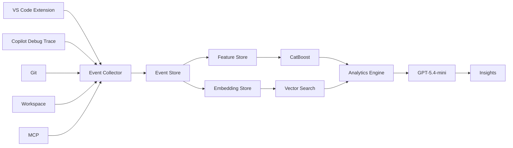
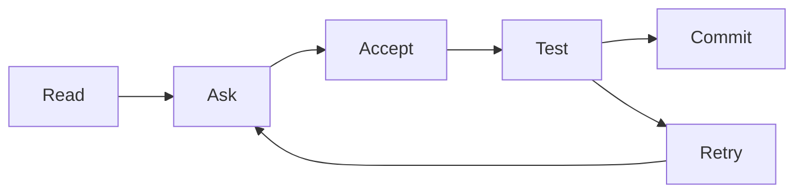
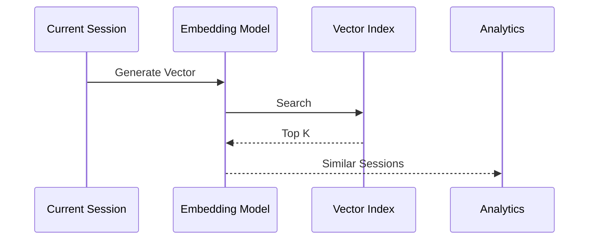
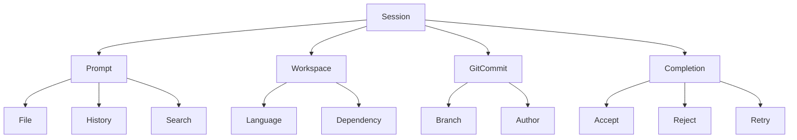
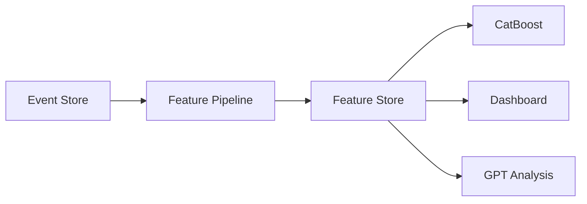
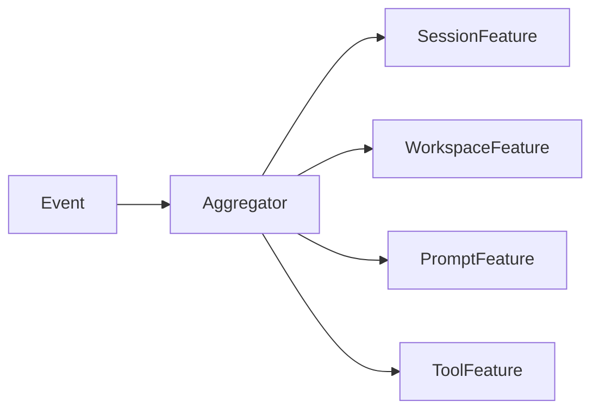

行为建模、工作流挖掘、失败分类、上下文价值评估、相似 Session 检索以及趋势分析。这些都怎么做？需要搭建什么基础设施？catboost 加embedding够不够


我的结论先说：

> **CatBoost + Embedding 只能完成约 60% 的能力。**如果目标是做一个真正有研究价值的 **AI Development Observatory**，至少应该是 **Event Store + Feature Store + Embedding + ML + LLM** 五层架构。LLM 不需要很多，但不能没有。

真正需要先设计的不是模型，而是**统一事件模型（Unified Event Model）**。目前 Copilot、Cursor、Continue、Claude Code 都没有统一的数据模型，所以后面的 ML、Embedding、分析都会受限。

# 1. 整体架构 (High-Level Architecture)



真正长期保存的数据只有两类：

* Event
* Feature

Embedding 可以重新计算。

CatBoost 可以重新训练。

GPT 根本不需要保存。

---

# 2. Event Store

这是整个系统最重要的。

建议不要直接存 Log。

应该先规范化。

例如

```typescript
interface IDEEvent {

    timestamp:number;

    sessionId:string;

    workspaceId:string;

    eventType:
        | "open_file"
        | "read_file"
        | "completion"
        | "accept"
        | "reject"
        | "retry"
        | "tool_call"
        | "terminal"
        | "chat";

    metadata:any;
}
```

后面所有能力都是 Event 的不同聚合。

---

# 3. Feature Store

Feature 才是 CatBoost 输入。

例如

| 分类         | Feature                    |
| ---------- | -------------------------- |
| Workspace  | 文件数量、总代码量、语言种类、依赖数量        |
| Session    | 持续时间、事件数、Prompt 次数         |
| Completion | Token、Latency、Accept       |
| Context    | Prompt 长度、History 长度、引用文件数 |
| Tool       | MCP 数量、Terminal 次数、Git 次数  |
| User       | 平均编辑次数、平均撤销次数              |

最后形成几百维 Feature。

---

# 4. Embedding Store

这里很多人容易误解。

Embedding 不是给 Event 做。

而是给：

* Prompt
* Session
* Workflow
* Error
* Workspace Snapshot

例如

```typescript
SessionEmbedding {

    sessionId

    embedding

}
```

查询：

> 今天这个 Session

直接找：

Top100 Similar Session。

---

# 5. 行为建模（Behavior Modeling）

这里根本不用 GPT。

完全可以：

Markov

或者：

Sequence Mining。

例如：

Session：

```text
Open

Read

Ask

Accept

Edit

Run

Retry

Accept
```

变成：

Event Sequence。

然后：

学习：

最常出现：

```text
Ask

Accept

Run

Commit
```

和：

失败：

```text
Ask

Retry

Retry

Cancel
```

最后：

得到：

Developer Behavior Model。

CatBoost 在这里帮助不大。

---

# 6. 工作流挖掘（Workflow Mining）

其实就是：

Process Mining。

工业界已经很成熟。

例如：

Alpha Miner

Heuristic Miner

Inductive Miner

直接输入：

Event Log。

自动恢复：

真正 Workflow。

例如：



这里甚至不用 ML。

---

# 7. 失败分类（Failure Classification）

这个：

CatBoost 很适合。

例如：

Label：

```text
Failure Reason
```

分类：

* Wrong Context
* Hallucination
* Timeout
* Retry Loop
* User Cancel
* Tool Error

Feature：

几十到几百维。

CatBoost：

直接训练。

以后：

预测：

失败原因。

---

# 8. Context ROI

这是我觉得最值得研究的。

问题：

Prompt：

到底：

哪些 Context 真有价值？

例如：

Prompt：

* README
* Git
* History
* Neighbor
* Search

最后：

Accept。

那么：

README

到底贡献多少？

这里：

CatBoost

可以直接：

SHAP。

得到：

| Context       | SHAP  |
| ------------- | ----- |
| Neighbor File | +0.35 |
| README        | +0.01 |
| History       | +0.12 |

以后：

自动删掉：

低价值 Context。

---

# 9. 相似 Session 检索

这个：

Embedding。

完全负责。

流程：



返回：

* Similarity

* Accept Rate

* Resolution

甚至：

直接：

推荐：

历史 Solution。

---

# 10. 趋势分析

这里：

CatBoost

反而不够。

因为：

趋势：

属于：

Time Series。

例如：

每天：

Accept：

```
78

76

75

72

65

```

更适合：

* Prophet

* XGBoost

* LightGBM

* Temporal Fusion Transformer

或者：

直接：

Rolling Window。

CatBoost：

不擅长：

时间趋势。

---

# 11. GPT 应该干什么？

很多人：

让 GPT：

分析全部 Log。

我认为：

浪费。

GPT：

真正应该：

只负责：

解释。

例如：

输入：

```json
{
  "AcceptRate":42,
  "RetryRate":33,
  "WorkspaceComplexity":91,
  "TopFailure":"ContextExplosion",
  "TopWorkflow":"Retry->Retry->Cancel"
}
```

GPT：

输出：

> 最近一周 Accept Rate 下降主要来自 Workspace Context 持续膨胀，Prompt 中平均引用文件数量增长 63%，而最终被模型实际利用的上下文占比没有同步提升，因此建议优先优化 Context Selection，而不是更换模型。

整个输入：

可能：

500 Token。

而不是：

50000 Token。

---

# 12. 我认为还缺一层：Session Graph

这是我觉得目前没人做，但最值得投入的基础设施。



这实际上是一张动态图（Temporal Property Graph）。

很多分析都可以直接转化为图查询，而无需重新扫描日志。例如：

* 找出所有最终成功但经历三次以上 Retry 的 Session。
* 分析某类 Workspace（例如大型 TypeScript Monorepo）是否更容易触发 Context Explosion。
* 统计某个 Tool、MCP Server 或 Prompt Pattern 对 Accept Rate 的长期影响。
* 发现某类失败是否集中发生在特定语言、依赖版本或工作流阶段。

## 我的建议

如果让我从零开始设计这个项目，我不会先写 CatBoost，也不会先接 GPT，而是按下面的顺序建设基础设施：

1. **Unified Event Schema**（统一事件模型）
2. **Event Store**（SQLite/DuckDB 即可）
3. **Feature Store**（离线计算 + 增量更新）
4. **Embedding Store**（sqlite-vec 或 FAISS）
5. **Session Graph**（关系与时间建模）
6. **CatBoost**（分类、排序、SHAP 解释）
7. **Workflow Mining**（Alpha Miner / Heuristic Miner / Inductive Miner）
8. **GPT-5.4-mini**（自然语言解释、根因分析、日报生成）

因此，**CatBoost + Embedding 是一个非常好的起点，但它们解决的是预测和语义相似性问题，而不是工作流恢复、时序行为建模、图关系分析和自然语言解释。**真正有创新性的系统，应当围绕统一事件模型和事件基础设施展开，把 CatBoost、Embedding 和 GPT 都作为建立在这一基础之上的分析能力，而不是系统本身。


---------------------------------------


Feature Store 是整个系统里**最容易被误解**的东西。很多人一想到 Feature Store，就会想到 Feast、Tecton 这种 ML 基础设施，但**对于 VS Code / Copilot Analytics 来说，完全没必要。**

你的规模（个人项目、开源项目）我反而建议采用**离线计算 + SQLite(DuckDB) Feature Store**。

---

# 整体架构 (High-Level Architecture)



Feature Store 本质上只有一句话：

> **把 Event 转换成 Machine Learning 可以直接使用的特征。**

例如：

Event

```json
{
  "type":"accept",
  "time":"09:12:01",
  "completionLength":420
}
```

不能直接训练。

必须转换：

```json
{
  "acceptRate7d":0.81,
  "avgCompletionLength":385,
  "retryRate":0.12,
  "workspaceComplexity":71
}
```

---

# Event ≠ Feature

例如：

Event

```json
[
  {"type":"retry"},
  {"type":"retry"},
  {"type":"accept"},
  {"type":"run"},
  {"type":"commit"}
]
```

真正 Feature：

| Feature        | Value |
| -------------- | ----: |
| retryCount     |     2 |
| acceptCount    |     1 |
| commitCount    |     1 |
| retryRatio     |  0.40 |
| workflowLength |     5 |

CatBoost 输入的是后者。

---

# Feature 应该如何组织？

我建议按 Domain。

例如：

```typescript
interface WorkspaceFeature {

    workspaceId:string;

    totalFiles:number;

    totalLOC:number;

    languageCount:number;

    dependencyCount:number;

    gitBranchCount:number;

}
```

---

```typescript
interface SessionFeature {

    sessionId:string;

    duration:number;

    completionCount:number;

    retryCount:number;

    acceptCount:number;

    rejectCount:number;

}
```

---

```typescript
interface PromptFeature {

    promptId:string;

    tokenCount:number;

    historyLength:number;

    retrievedFiles:number;

    retrievedSymbols:number;

}
```

---

```typescript
interface ToolFeature {

    terminalCalls:number;

    gitCalls:number;

    mcpCalls:number;

    filesystemCalls:number;

}
```

最后：

Feature Store：

其实就是：

```text
Workspace Feature

Session Feature

Prompt Feature

Tool Feature

```

四张表。

---

# Feature Pipeline

建议不要实时。

完全没必要。

例如：



比如：

Session 结束。

或者：

每隔一分钟。

重新计算。

---

# Feature 如何计算？

例如：

Accept Rate

Event：

```json
accept

reject

accept

accept
```

Feature：

```typescript
acceptRate =
accept/(accept+reject)
```

---

Retry Rate：

```typescript
retryRate =
retry/completion
```

---

Workspace Complexity：

```typescript
complexity =
0.4*log(fileCount)
+
0.3*languageCount
+
0.3*dependencyCount
```

后面：

可以升级。

---

Prompt Density：

```typescript
density =
promptToken/contextToken
```

---

History Ratio：

```typescript
historyRatio =
historyToken/
promptToken
```

---

# Feature Store 用什么数据库？

我的建议：

SQLite。

例如：

```sql
CREATE TABLE session_feature(

session_id TEXT PRIMARY KEY,

duration INTEGER,

accept_rate REAL,

retry_rate REAL,

completion_count INTEGER,

tool_calls INTEGER,

workspace_complexity REAL,

embedding_id TEXT

);
```

查询：

```sql
SELECT *

FROM session_feature

WHERE retry_rate>0.3;
```

结束。

---

如果：

以后：

几十 GB。

DuckDB。

基本结束。

根本不用：

Redis

Elastic

ClickHouse

Feast

---

# Feature Version

这一点很多项目都会踩坑。

Feature：

不能覆盖。

例如：

今天：

```text
workspaceComplexity
```

算法：

```text
v1
```

后来：

改了。

变：

```text
v2
```

训练：

全部废掉。

建议：

```typescript
interface FeatureVersion{

    featureName:string;

    version:number;

}
```

或者：

Feature 表：

增加：

```sql
feature_version
```

以后：

模型：

知道：

自己：

训练：

哪一版。

---

# Feature Registry

Feature：

不要：

到处写。

建议：

统一：

```typescript
interface FeatureDefinition{

    name:string;

    description:string;

    owner:string;

    extractor:string;

}
```

例如：

```typescript
{

name:"retryRate",

description:
"retry/completion"

}
```

以后：

Dashboard

CatBoost

GPT

全部：

查：

Registry。

---

# 我认为最值得做的一点

很多 Feature Store 都是**统计量**。

例如：

* retryCount
* acceptRate
* latency

这些都是 Aggregation Feature。

但是你的项目最大的创新点，我认为应该加入 **Behavior Feature（行为特征）**。

例如：

一个 Session：

```text
Read File

Ask

Accept

Run Test

Retry

Accept

Commit
```

不要只统计：

```text
retry=1
```

而是计算：

```typescript
interface BehaviorFeature{

    avgReadBeforeAsk:number;

    avgRetryDistance:number;

    toolSwitchFrequency:number;

    contextExpansionSpeed:number;

    workflowEntropy:number;

}
```

这些特征描述的是**开发行为本身**，而不是事件计数。

举几个例子：

| Feature                 | 含义                            |
| ----------------------- | ----------------------------- |
| `workflowEntropy`       | 工作流是否混乱，还是高度稳定                |
| `contextExpansionSpeed` | Prompt 上下文膨胀速度                |
| `toolSwitchFrequency`   | Terminal、Git、Chat、Editor 切换频率 |
| `retryBurstScore`       | 是否出现连续 Retry 爆发               |
| `editAfterAcceptRatio`  | 接受 AI 建议后立即修改的比例              |
| `completionPersistence` | AI 生成代码最终保留比例（结合 Git 历史）      |

**这些 Feature 才是真正有研究价值的部分。**绝大多数 Copilot Analytics 项目停留在事件统计层，而行为特征能够描述开发过程的动态模式，是后续 CatBoost、Embedding 聚类、Session 相似性分析乃至 GPT 根因分析都可以共享的高价值输入。


-------