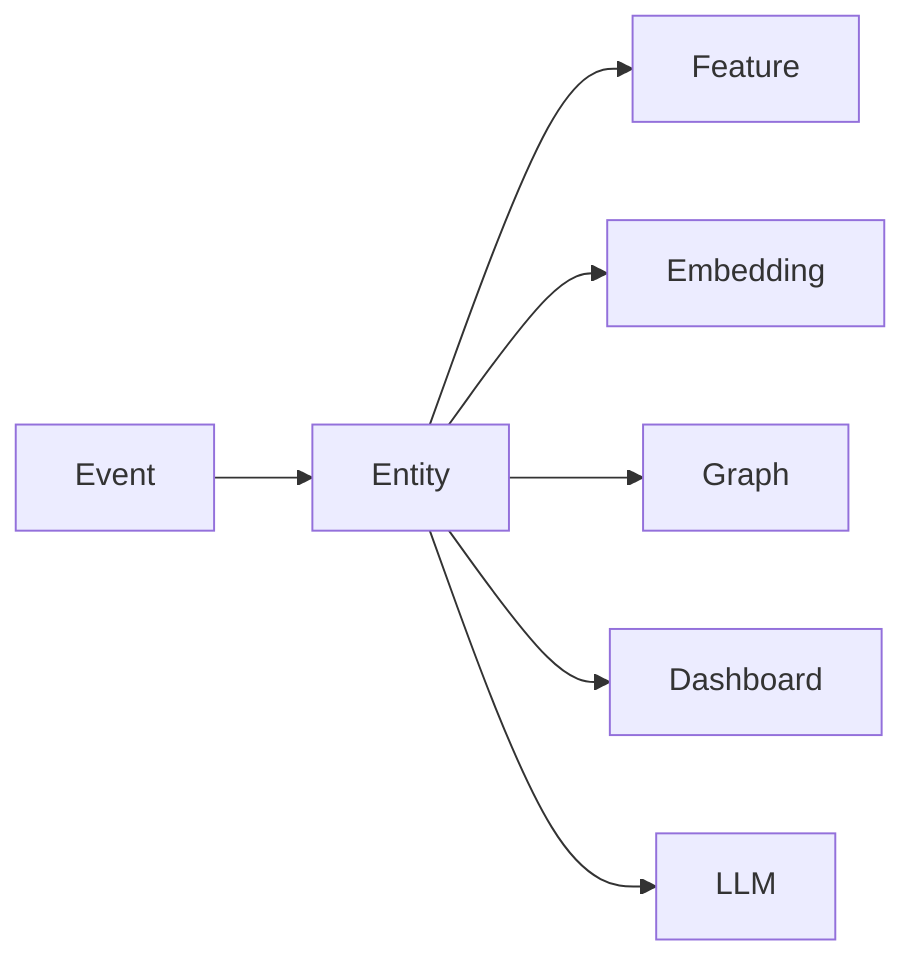
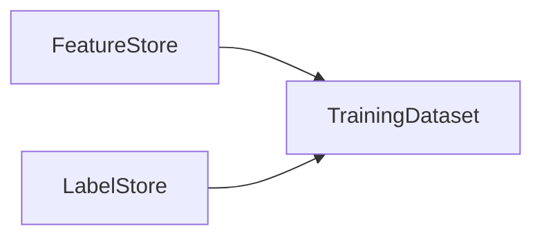
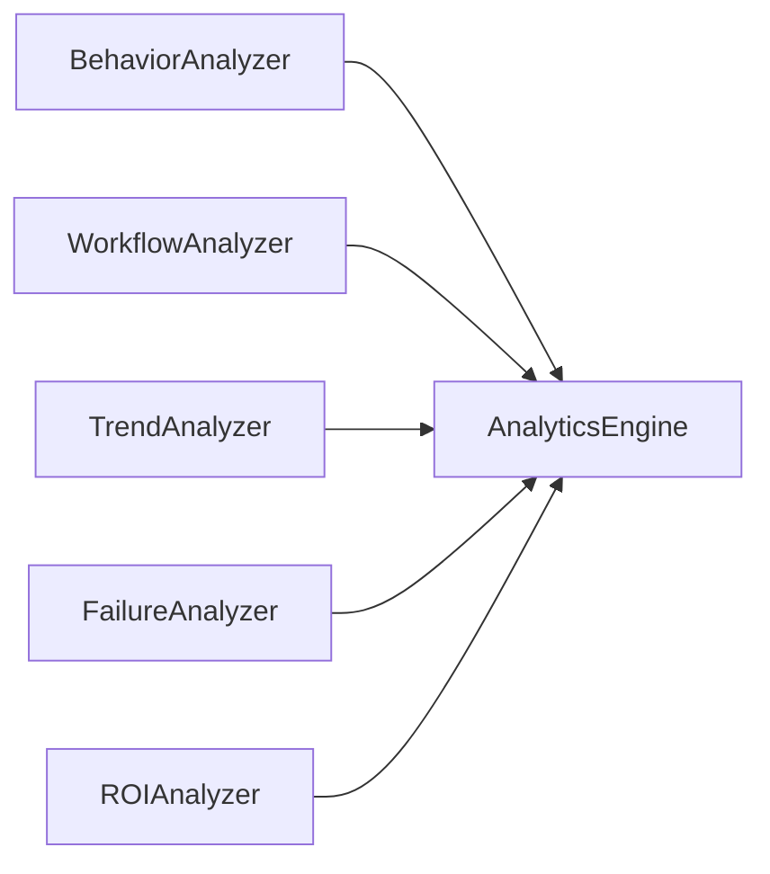

重新看了一遍你的 **V6 架构文档**，我的判断没有变化：**整体架构已经比较成熟，不建议继续增加新的模块，而应该继续优化各层之间的职责边界。**下面是我认为最值得调整的几个地方。

---

# 1. Feature Pipeline 的职责过重（最高优先级）

目前文档中，`FeaturePipeline` 同时负责事件聚合（Aggregation）、特征计算（Feature Computation）以及特征写入（Materialization）。随着 Feature 数量增加，这个类最终会成为整个系统最复杂的模块。

建议拆分成三个独立阶段：


其中：

* **Aggregator** 负责从 Event 中提取中间统计信息，例如 Session 内事件数量、Completion 数量、Tool 调用次数等。
* **Feature Calculator** 根据这些中间统计结果计算真正的 Machine Learning Feature，例如 `acceptRate`、`workflowEntropy`、`retryBurstScore`。
* **Feature Store** 只负责持久化，不包含任何业务逻辑。

这样做最大的好处是，新增一个 Feature 时通常只需要新增一个 Calculator，而不会影响 Event 聚合逻辑。

---

# 2. 建议增加 Canonical Entity Layer

这是我认为整个 V6 最值得增加的一层。

目前 Graph、Feature、Embedding 三个模块都直接围绕 Session、Prompt、Workspace 等对象建立自己的数据结构。虽然现在还能保持一致，但随着系统演进，它们很容易形成三套不同的对象模型。

建议增加一层统一的领域模型（Entity Layer）：



例如：

```typescript
interface Session {}
interface Prompt {}
interface Completion {}
interface Workspace {}
interface ToolInvocation {}
interface Failure {}
```

这样之后：

* Graph 负责描述 Entity 之间的关系；
* Feature 从 Entity 聚合计算；
* Embedding 对 Entity 建立向量；
* LLM 分析 Entity；
* Dashboard 展示 Entity。

整个系统只有一套领域对象，而不是每个模块维护自己的 Session 定义。这种设计更符合 DDD（Domain-Driven Design）的思想，也会降低长期维护成本。

---

# 3. Embedding Pipeline 建议彻底插件化

目前文档已经预留了 `model` 字段，但 Pipeline 本身仍然是固定实现。

建议定义统一接口，例如：

```typescript
interface EmbeddingProvider {
    id: string;
    generate(entity: Entity): Float32Array;
}
```

之后可以很容易支持：

* Feature Vector（手工构造特征向量）
* nomic-embed-text
* BGE-M3
* OpenAI Embedding
* 未来其它本地模型

Embedding Pipeline 不需要知道底层模型是什么，只需要调用统一接口即可。

---

# 4. Feature 不建议全部存储为 JSON

目前文档采用 `features TEXT` 保存 JSON，这种方式灵活性很好，但对于 Analytics 和 Machine Learning 并不友好。

建议采用“双存储”策略：

* 原始 Feature 仍然保存为 JSON，方便版本演进。
* 同时维护 Materialized View（或宽表），把常用 Feature 展开成独立字段。

例如：

| session_id | accept_rate | retry_rate | workflow_entropy | context_growth |
| ---------- | ----------: | ---------: | ---------------: | -------------: |

这样 CatBoost、SQL 查询、DuckDB 分析都可以直接使用，不需要大量 `JSON_EXTRACT`。

---

# 5. Label Store 建议独立

目前 Label 和 Feature 放在同一模块中，我建议拆开。



原因是两者生命周期完全不同：

* Feature 会不断重新计算；
* Label 往往来自人工标注或后验结果。

例如 Session 结束时 Feature 已经生成，但几天之后用户提交了 Git Commit，这时才能知道 AI 生成代码最终是否保留，这属于新的 Label，而不是新的 Feature。

---

# 6. Workflow Mining 应直接读取 Event

这一点文档实际上已经接近正确，但我建议明确规定：

> Workflow Mining 永远读取 Event，而不是 Feature。

原因是 Workflow 是事件序列，而 Feature 已经是聚合后的统计结果，很多时序信息已经丢失。

例如：

```
Read File
Ask AI
Retry
Retry
Accept
Run Test
Commit
```

如果变成：

```json
{
  "retryCount": 2,
  "acceptCount": 1
}
```

那么原来的执行顺序已经无法恢复。

---

# 7. Graph 不建议保存 Feature

Graph 节点建议只保存 Entity 和引用。

例如：

```text
Session
 └── featureVersion = 4
```

真正的 Feature 仍然放在 Feature Store。

这样 Feature 更新时无需重建整张 Graph，只需要重新计算 Feature 即可。

---

# 8. Analytics Engine 建议拆成插件体系

目前 Analytics Engine 包含：

* Behavior
* Workflow
* Trend
* Failure
* ROI

建议改成插件化结构：



Analytics Engine 本身只负责调度和汇总结果，不负责具体分析逻辑。

这样以后新增一个新的 Analyzer，不需要修改 Analytics Engine。

---

# 9. LLM Payload 建议 Schema 化

目前 `llmPayload` 更像一个自由 JSON。

建议定义固定 Schema，例如：

```typescript
interface AnalyticsSummary {
    sessionId: string;
    topFailure: string;
    workflowPattern: string;
    acceptRate: number;
    retryRate: number;
    contextGrowth: number;
    recommendations: string[];
}
```

这样 Prompt 更稳定，也便于未来切换模型。

---

# 10. 建议增加 Registry 体系

目前已经有 Feature Registry，我建议继续增加：

| Registry           | 职责                                  |
| ------------------ | ----------------------------------- |
| Event Registry     | 管理 Event Schema、Provider Mapping、版本 |
| Feature Registry   | 管理 Feature 定义、计算方式、版本               |
| Analyzer Registry  | 注册各类 Analyzer，实现插件化                 |
| Embedding Registry | 注册 Embedding Provider               |

这样整个系统会形成统一的元数据管理体系。

---

# 我的总体评价

**V6 的整体架构已经完成了大约 85% 的设计工作。** 我不会继续增加新的分析能力，而会重点提升架构的可演进性和模块边界。按优先级，我建议依次完成：

1. 拆分 Feature Pipeline，明确聚合、计算和持久化三层职责。
2. 增加 Canonical Entity Layer，建立统一领域模型。
3. 将 Analytics Engine 改造成插件化 Analyzer 架构。
4. 将 Embedding Pipeline 改造成 Provider 插件体系。
5. 建立 Event Registry、Embedding Registry 和 Analyzer Registry。

完成这些调整之后，整个系统的扩展性会明显提升。未来无论增加新的 AI 编程助手、Embedding 模型、分析算法还是 Machine Learning 模型，都可以通过新增 Adapter、Provider 或 Analyzer 实现，而无需修改核心架构。这也是我认为 V6 最值得继续打磨的方向。
