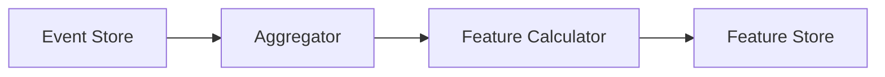
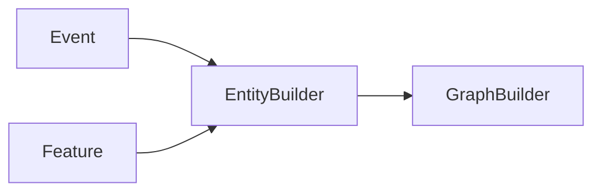
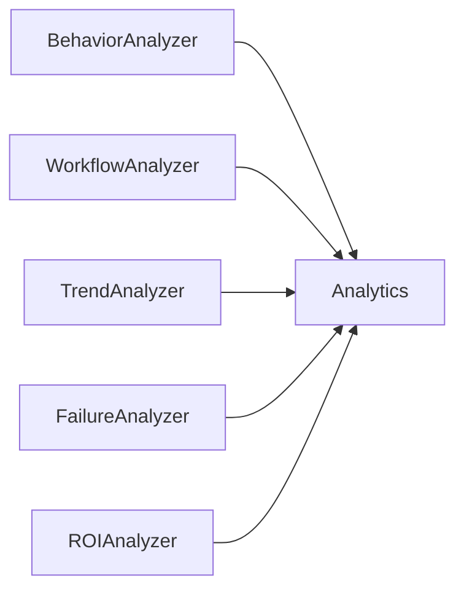
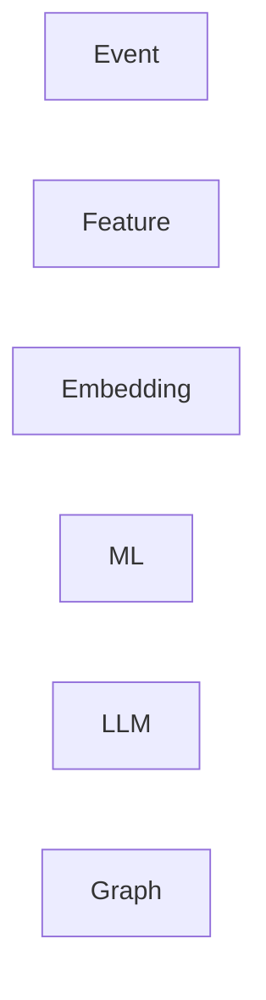
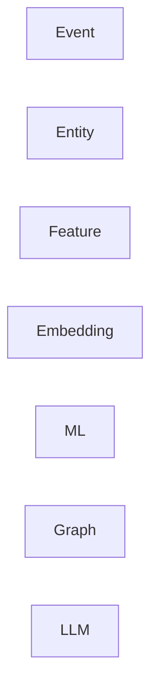

我认真看了你的 V6 文档。我认为**整体方向已经对了**，而且比很多开源项目更完整。真正的问题已经不是"缺功能"，而是**几处架构边界还不够清晰**。下面这些是我认为值得在 V6 再调整的地方（按优先级排序）。

---

# 1. 最大的问题：Feature Pipeline 职责过重（我认为必须调整）

目前文档中：

> `FeaturePipeline` 负责五类 Aggregator、31 个 Feature、computeSession、computeAllSessions。

这实际上把三种职责混在了一起：

* Event Aggregation
* Feature Computation
* Feature Materialization

建议拆成三层。



例如：

```
SessionAggregator
WorkspaceAggregator
PromptAggregator
```

只负责：

> Event → Intermediate Aggregate

然后：

```
BehaviorFeatureCalculator

ContextFeatureCalculator

WorkspaceFeatureCalculator
```

负责：

Aggregate → Feature

最后：

```
FeatureStore

```

负责：

Persistence。

这样以后：

增加 Feature：

不用修改 Aggregator。

---

# 2. Event 和 Session Graph 不应该直接耦合

目前：

GraphBuilder：

```
EventStore

↓

FeatureStore

↓

Graph
```

实际上：

Graph 应该来自：

Canonical Entity。

建议：



例如：

Graph：

不应该知道：

Event。

应该知道：

```
Session

Prompt

Workspace

Completion

Tool

Failure
```

这些 Entity。

否则：

以后：

Graph

越来越复杂。

---

# 3. Embedding Pipeline 应该 Plugin 化

目前：

EmbeddingPipeline：

固定：

```
Feature-based

10维

5维
```

文档已经预留 model 字段。

但是：

Pipeline：

还是固定。

建议：

```typescript
interface EmbeddingProvider{

    id:string;

    generate(entity):Float32Array;

}
```

例如：

以后：

```
feature-v1

text-embedding-3-small

nomic

bge-m3

```

全部：

不用修改：

Pipeline。

---

# 4. Feature 不应该全部 JSON Blob

这是我唯一比较担心的地方。

目前：

```
features TEXT
```

JSON。

对于：

Storage：

很好。

但是：

Analytics：

不好。

建议：

保留：

JSON。

另外：

增加：

Materialized View。

例如：

```
session_feature_view
```

里面：

```
acceptRate

retryRate

workflowEntropy

...
```

全部：

真正列。

这样：

DuckDB

SQLite

SQL

CatBoost

全部：

直接查询。

不用：

JSON_EXTRACT。

---

# 5. Label Store 独立

目前：

```
FeatureStore.writeLabel()
```

我觉得：

Label：

不属于：

Feature。

建议：

```mermaid
flowchart LR

FeatureStore

LabelStore

↓

Training Dataset
```

Label：

生命周期：

完全不同。

例如：

今天：

Label：

更新。

Feature：

没有更新。

应该：

独立。

---

# 6. Workflow Mining 应该直接读取 Event

这一点：

文档：

其实已经这样设计。

我建议：

明确：

不要：

走：

Feature。

因为：

Workflow：

本来：

就是：

Sequence。

Feature：

已经：

损失：

信息。

---

# 7. Graph 不应该存 Feature

Graph：

应该：

存：

Reference。

例如：

Node：

```
Session
```

Attribute：

```
featureVersion=4
```

真正：

Feature：

仍然：

Feature Store。

否则：

以后：

Feature：

更新。

Graph：

全部：

重建。

---

# 8. Analytics Engine 太胖

目前：

Analytics：

负责：

* Trend

* ROI

* Failure

* Workflow

* Behavior

* Payload

建议：

改：



Analytics：

只负责：

Merge。

以后：

非常容易：

增加：

新的：

Analyzer。

---

# 9. LLM Payload 建议 Schema 化

目前：

```
llmPayload
```

JSON。

建议：

直接：

定义：

```typescript
interface AnalyticsSummary{

}
```

以后：

Prompt：

固定。

模型：

也容易：

升级。

---

# 10. 我认为整个系统还缺一个 Registry

目前：

有：

Feature Registry。

我建议：

增加：

三个：

Registry。

| Registry          | 作用                                                |
| ----------------- | ------------------------------------------------- |
| Feature Registry  | Feature 定义                                        |
| Event Registry    | Event Schema、Provider Mapping、版本管理                |
| Analyzer Registry | 注册 Behavior、Trend、Workflow、Failure、ROI 等 Analyzer |

这样：

以后：

真正：

Plugin。

---

# 我认为还可以增加一个比 Session Graph 更重要的层

这是我看完整个文档以后，觉得唯一缺失的核心基础设施。

目前：



我建议：

变成：



增加：

**Entity Layer（Canonical Domain Model）**。

例如：

```typescript
interface Session{}

interface Prompt{}

interface Completion{}

interface Workspace{}

interface ToolInvocation{}

interface Failure{}

interface Recommendation{}
```

原因很简单：

目前：

Graph

Feature

Embedding

三层：

其实：

都在：

自己：

理解：

Session。

如果：

增加：

Entity。

以后：

* Graph 直接引用 Entity。
* Feature 从 Entity 聚合。
* Embedding 对 Entity 建向量。
* LLM 引用 Entity。
* Dashboard 展示 Entity。

整个系统：

真正：

变成：

**DDD（Domain-Driven Design）**。

---

## 我的总体评价

**V6 已经完成了约 85% 的基础设施设计。**我不会再增加新的分析能力，而会继续强化架构的可演进性。按优先级，我建议依次完成：

1. **拆分 Feature Pipeline（最高优先级）**，避免聚合、计算、持久化耦合。
2. **引入 Canonical Entity Layer**，作为 Event 与 Feature/Embedding/Graph 的统一领域模型。
3. **Analyzer Plugin 化**，将 AnalyticsEngine 从“大总管”变为编排器。
4. **Embedding Provider Plugin 化**，允许 Feature 向量、本地 Embedding、云端 Embedding 共存。
5. **Event / Analyzer Registry**，补齐整个系统的元数据体系。

这几项完成后，我认为这个架构已经具备发表级或长期演进级的质量，不需要再继续增加新的分析模块，而是可以开始沉淀真实数据、验证特征和训练模型。
